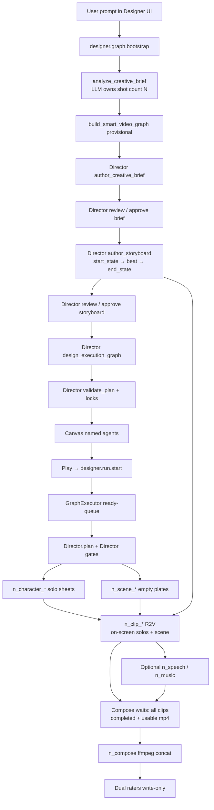

# Designer video pipeline — DETAIL

Reproduce the AI-first **prompt → film** Play path (quality graph
`designer.graph.smart_video.quality.v5`) as running on branch
`design-no-keyframes-2.0`.

This file documents architecture, **pipeline roles**, **agent spawning**,
**scene bible / hierarchical views**, locks, audio routing, scheduling, LLM
shot budgeting, compose readiness, and how to run the stack.

Short companion notes: `a.md`. Per-node docs:
`jiuwenswarm/server/runtime/designer/docs/INDEX.md`.

---

## 0. End-to-end workflow (user prompt → final film)



**Continuity (code truth):** the **storyboard** owns each shot’s closed window
(`start_state` → action/camera/speech → `end_state`). One **empty scene plate**
per `setting_id` (no people). Each **clip is the shot**: R2V with
`reference_images` = **on-screen** character solos + the scene plate
(`scene_card_plus_clip_shots` / R2V). Prompts are **story-form**. Same-setting clips do **not**
depend on prior Wan text or prior clip nodes — they run **concurrently** once
storyboard + needed solos + scene are ready. Exited cast is omitted until the
storyboard returns them on_screen. **No** `n_frame_*` keyframes.

**Shot count:** the Director LLM owns `target_shot_count` (prefer ≤8, hard
max 16). Prefer fewer shots: same cast + same setting + continuous motion
(including a pan) = one clip; put camera motion in the video prompt. New
clip only on hard cut, new setting, wardrobe/prop change, large pose/framing
jump, or on-screen cast change. Explicit user `N-shot` / `N分镜` is a hard
ceiling. Chat model is required — Enter / chat / Play fail closed without one.

---

## 1. What this pipeline does

User prompt (natural language) → Designer execution graph → **one forward Play**:

1. **Director** authors **Production Brief** + **Storyboard**
   (with per-shot start/end states), decides shot count, then (after Director lock)
   **builds the graph** and assigns **minimal tools**.
2. **Director (= Producer)** gates Brief/Storyboard vs the user prompt, stamps
   **scene locks**, **prunes nodes that cannot reach `n_compose`**, re-edits
   artifacts, reviews **every leaf media prompt**, and enforces the storyboard
   continuity contract so completed beats / speech are not restaged.
3. **Leaf workers** (`NodeAgentHost` DeepAgents) and/or **handlers** produce
   solo cast sheets, empty scene plates, clips-as-shots, optional speech/music,
   then **compose** a real `.mp4` only after every clip is completed and usable.
4. **Dual rater agents** score the run; feedback JSON is write-only and applied
   only on an explicit **Run again** (`use_prior_feedback`).

Designer requires a configured chat model and fails closed when model calls fail.

---

## 2. Pipeline roles (what each node does)

| Node id pattern | Role | Type | Job |
|-----------------|------|------|-----|
| `n_brief` | `brief` | text | Production brief + lock bible |
| `n_storyboard` | `storyboard` | table/text | Timed windows: start/end state, occupancy, camera, speech |
| `n_character` / `n_character_*` | `character_design` | image | Solo identity sheet per named human (wardrobe locked) |
| `n_scene_*` | `scene` | image | Environment-only plate per `setting_id` — geography / light / props |
| `n_clip_*` | `clip` | video | R2V shot: on-screen solos + empty scene; story-form; concurrent |
| `n_speech` | `speech` | audio | Optional TTS bed when backend + brief request it |
| `n_music` | `music` | audio | Optional BGM bed when backend + brief request it |
| `n_compose` | `compose` | video | ffmpeg concat of **all** clips (+ mux speech/music); hard-waits media |

**Canvas labels** (`node_labels.py`): `Brief: …`, `Story Board: …`,
`Character N: …`, `Scene N: <2–3 word place>`, `Scene S: Clip K: <beat>`,
`Final Composed: …` — never generic `Image N` / `Video N`. Shot cards are gone;
clips are the shots.

**Orchestrators (not graph nodes):**

| Agent | Responsibility |
|-------|----------------|
| Director | Brief, storyboard, shot budget, graph redesign, plan directives |
| Director | Approve/edit gates, prune, scene locks, leaf prompt gate, dual rate |
| Leaf DeepAgent | Per-node tools: `call_model`, `call_image_model`, `call_video_model`, `ffmpeg_compose` |
| Handler | Deterministic media when `delegate=handler` or after agent authors a spec |

---

## 3. Frontend ↔ backend

```
DesignerPage
  └─ Play → designerRunStore.advance()
       (one start for remaining pipeline; auto-resume if pending nodes remain)
  └─ designerGraphClient.startRun / bootstrap
  └─ webClient WebSocket RPC
       designer.graph.bootstrap | designer.run.start | designer.run.get
  └─ AgentServer AdapterRegistry
  └─ DesignerAdapter (gateway_adapter/designer_adapter.py)
       ├─ bootstrap → script_analysis + build_smart_video_graph
       └─ start_run → GraphExecutor.create_run / start_run
  └─ events: DESIGNER_RUN_UPDATED / NODE_UPDATED / GRAPH_UPDATED
  └─ UI bindDesignerRuntime() (+ poll designer.run.get)
```

| Layer | Path |
|-------|------|
| UI client | `jiuwenswarm/channels/web/frontend/src/features/designer/designerGraphClient.ts` |
| Bootstrap UI | `…/designerBootstrapGraph.ts` |
| Run store | `…/designerRunStore.ts` |
| Canvas / labels | `…/designerCanvasNodes.ts`, `DesignerPage.tsx`, `node_labels.py` |
| RPC adapter | `jiuwenswarm/server/runtime/gateway_adapter/designer_adapter.py` |
| Executor | `jiuwenswarm/server/runtime/designer/executor.py` |
| Graph build | `…/smart_graph.py` |
| Orch | `…/orchestration.py` |
| Script / shot budget | `…/script_analysis.py`, `…/pipeline/director_contract.py` |
| Leaf DeepAgent | `…/node_agent.py` (`NodeAgentHost`) |
| Compose | `…/handlers/compose.py` |
| Schema / roles | `jiuwenswarm/common/schema/designer_graph.py` |
| Playbook | `…/media_model_playbook.py` |
| Scene policy | `…/pipeline/keyframe_policy.py` |

Media and run state live under `JIUWENSWARM_DATA_DIR` or `~/.jiuwenswarm`
(`agent/workspace/`, `agent/designer/graphs|runs|feedback/`).

---

## 4. Quality DAG (v5)

```
n_brief (text)
  → n_storyboard (table; start_state → beat → end_state)
  → n_character_*  (solo identity sheets)
  → n_scene_*      (one empty plate per setting_id)
  → n_clip_*       (R2V: on-screen solos + empty scene; story-form;
                    deps = storyboard + on-screen solos + scene; concurrent)
  → n_speech / n_music  (only if TTS/BGM backends exist; else clip-embedded)
  → n_compose      (wait all clips usable → ffmpeg concat + mux)
```

Bootstrap stamp: `metadata.bootstrap = designer.graph.smart_video.quality.v5`.  
**Scene cards are required.**
`metadata.scene_continuity_mode = scene_card_plus_clip_shots`.  
`metadata.freeze_shot_topology = False` — Director owns a **flexible**
multi-shot graph; storyboard / LLM `target_shot_count` drives `n_clip_*`
(and one `n_scene_*` per unique setting).

### Scene plate + clip-as-shot policy

- **Solo gate:** every named character gets a solo identity card. Only
  **on-screen** solos for that shot become clip `reference_images`.
- **Scene plates:** one `n_scene_N` per `setting_id`, labeled
  `Scene N: <2–3 word place>`. **Empty** — furniture/light/props only, no cast.
- **Clips are shots:** each `n_clip_*` depends on **storyboard**, **on-screen**
  solos, and its setting’s scene plate — **not** brief, not prior clips.
  Config carries `start_state` / `end_state`, `scene_node_id`, occupancy,
  `on_screen` / `offscreen`, costume / spatial / staging locks, speech locks,
  and R2V reference mode (`keyframe_strategy = clip_from_scene_and_solos`).
- **Video reference mode:** attach on-screen solos + Scene N as
  `reference_images` (not a peopled first_frame). Prompt is story-form from
  this row’s start → beat → end — Director rewrite via
  `video_prompt_practice.py`. Positive only: no forbid / examples /
  sit-stand hardcodes on the API body.
- **Same-setting continuity:** storyboard chain (`shot N start` = `shot N−1 end`)
  plus `already_done` / `forbidden_speech` from prior **storyboard** rows.
  Never cross rooms. Exited cast stays off prompts until returned on_screen.
- **Concurrency:** no clip→clip edges; ready clips run up to concurrency **3**.
- **Hard style default:** unspecified brief → film-wide **photoreal cinematic**.
- **Lock gate:** Director `review_leaf_media_prompt` + continuity contract then
  `director_approve_video_prompt` before every clip tool call.

### Hierarchical scene bible (per setting)

| Field | Purpose |
|-------|---------|
| `place` / `architecture` | One coherent geography |
| `lighting` | Stable key direction; no relight mid-scene |
| `objects` | Landmarks / props that exist in every view even if off-camera |
| `crowd` | Density / silhouette lock |
| `views` | `front`, `left`, `right`, `side`, `top`, `bottom` |
| `active_view` | This clip’s camera |
| `coherence_rule` | Nothing pops into existence when the camera moves |

### Storyboard continuity (not prior-Wan handoff)

- After storyboard completes, clip configs are stamped with start/end,
  action, camera, speech (`sync_shot_nodes_from_storyboard_markdown` /
  `stamp_shot_states_on_clip_cfg`).
- `already_done` / speech uniqueness come from prior storyboard rows in the
  same setting (`clip_continuity_contract.py`) — not from prior Wan dumps.
- `last_wan_prompt` is saved on the **same** clip for regenerate/debug only.
- Same-setting clips are **concurrent** once deps are ready.

### Compose readiness (anti black / 0:00 film)

- Scheduler: compose is **never** a soft artifact dep — waits for every clip
  (+ separate speech/music when present).
- Handler polls until all clip nodes are **completed** with usable mp4
  (size + duration; rejects empty / 0:00 stubs and still→mp4 freezes).
- Agent `ffmpeg_compose` returns blocked if clips are still running.
- Disk fallback only uses `designer_clip_{run_id}*.mp4` — not random
  `generated_*.mp4`.

### Audio

- Probe TTS/BGM at plan time (`detect_audio_backends`).
- Available + Brief wants stems → `n_speech` / `n_music` into compose.
- Missing → `audio_routing.clip_embedded=true`; style folded into clip prompts.
- Compose muxes real audio beds when stems exist.

---

## 5. Agent spawning

| Role | How created | When |
|------|-------------|------|
| **Director** | In-process via `call_model_tool` | Brief / Storyboard → rebuild graph → plan → finalize |
| **Director** | Same | Capabilities → lock gate → validate/prune → leaf prompt gate → dual raters |
| **Leaf DeepAgent** | `NodeAgentHost` → `create_deep_agent` | Each ready node with `config.delegate=agent` |
| **Handler** | Role handler class | `delegate=handler` or agent failure / `force_handler` |
| **Rater A / B** | Director `dual_rate_final` | After film completes |

Leaf tools (minimal per role): `call_model`, `call_image_model`,
`call_video_model`, `ffmpeg_compose`, graph get/patch, `designer_node_complete`.

Concurrency: `_MAX_CONCURRENT_NODE_AGENTS = 3`. Soft deps unlock clip↔clip /
scene-prompt handoff early; scene→clip and compose stay hard.

---

## 6. Scheduling & Play order

`GraphExecutor._execute_wave_run` — continuous ready-queue (no wave barrier).

```
1. Play entry requires a chat model (`require_llm`)
2. Skip Enter redesign when director_composed_on_bootstrap
3. Director.decide_capabilities
4. Director.plan
5. Director.validate_plan (+ prune / identity stamp)
6. Ready-queue leaves; Director.review_leaf_media_prompt before each scene/clip
7. Scene-card prompt handoff onto same-setting clips
8. Serial clips + Wan prompt stamp onto next clip
9. Compose only when all clips completed + usable
10. Director.finalize + Director.review + dual_rate_final
11. write_run_feedback (apply_on=run_again_only)
```

Duration in the user prompt constrains **total film time / timelines**.
Shot count is LLM-owned (with soft/hard caps above).

---

## 7. Key source files

```
jiuwenswarm/server/runtime/designer/
  README.md                 # this package's module map
  smart_graph.py            # build_smart_video_graph (v5 empty plates + clip shots)
  script_analysis.py        # LLM creative brief + shot budget (heuristic_analysis test-only)
  orchestration.py          # Director, prune+reedit, leaf prompt gate
  executor.py               # ready-queue (≤3), storyboard sync, compose hard-wait
  node_agent.py             # NodeAgentHost; call_image_model → generate_designer_image
  node_labels.py            # Brief / Story Board / Scene / Clip / Final Composed
  model_tools.py            # call_model / image / video tools
  media_model_playbook.py   # Qwen / Wan / MiniMax lock clauses
  audio_locks.py
  pipeline/
    storyboard_shot_state.py   # start_state / end_state normalize + stamp
    clip_continuity_contract.py # already_done / speech uniqueness / reject redo
    video_prompt_practice.py   # story-form compose + manager/supervisor approve
    wan_call_locks.py          # video API rewrite entry
    wan_r2v_best_practices.py  # positive R2V formula
    wan_reference_binding.py
    wan_prompt_hygiene.py
    clip_story_state.py        # self Wan stamp; prior-clip ensure no-op w/ start_state
    clip_prompt_handoff.py     # last_wan_prompt on self only
    clip_shot_scope.py
    keyframe_policy.py         # scene bible / ensembles (no n_frame_*)
    production_bible.py
    leaf_agent_continuity.py
    clothing_lock.py / shot_staging_lock.py / axis_locks.py / cast_prop_locks.py
    director_contract.py
    skills/wan-reference-video/
  handlers/
    image_nodes.py  clip.py  compose.py  audio_nodes.py  text_nodes.py  common.py

jiuwenswarm/server/runtime/gateway_adapter/designer_adapter.py
jiuwenswarm/common/schema/designer_graph.py
jiuwenswarm/channels/web/frontend/src/features/designer/
jiuwenswarm/agents/harness/common/tools/{image_tools,video_tools,multimodal_config}.py
```

---

## 8. Reproduce locally

### Config

1. Conda/venv with project deps (do **not** commit `.venv` / `Lib/` / `pyvenv.cfg`).
2. `~/.jiuwenswarm/config/.env` with chat + image + video keys as required by Settings.
3. `ffmpeg` on PATH (or `imageio-ffmpeg`) for compose / audio beds.

### UI path

1. `jiuwenswarm-start all` (or stop then `jiuwenswarm-start all`).
2. Open http://127.0.0.1:5173/ → Designer → bootstrap a video prompt → **Play**.
3. Inspect `~/.jiuwenswarm/agent/workspace/` for compose mp4.
4. Canvas labels: `Brief:…`, `Character N:…`, `Scene N:…`, `Scene S: Clip K:…`,
   `Final Composed:…`.

### Import-level check (no media cost)

```bash
conda run -n new --no-capture-output python -c "from jiuwenswarm.server.runtime.designer.smart_graph import build_smart_video_graph; from jiuwenswarm.server.runtime.designer.orchestration import Director, Director; print('ok')"
```

Topology smoke (scene cards + clip-as-shot; no `n_frame_*`):

```bash
conda run -n new --no-capture-output python -c "
from jiuwenswarm.server.runtime.designer.pipeline.keyframe_policy import apply_compose_solos_setting_policy
from jiuwenswarm.server.runtime.designer.smart_graph import build_smart_video_graph
a=apply_compose_solos_setting_policy({
  'characters':[{'id':'char_1','name':'Alex'},{'id':'char_2','name':'Sam'}],
  'scenes':[{'id':'set_a','name':'Hall'},{'id':'set_b','name':'Street'}],
  'shots':[
    {'shot_index':1,'setting_id':'set_a','on_screen':['char_1'],'action':'speaks'},
    {'shot_index':2,'setting_id':'set_a','on_screen':['char_2'],'action':'exits'},
    {'shot_index':3,'setting_id':'set_b','on_screen':['char_2'],'action':'outside'},
  ],
})
g=build_smart_video_graph(project_id='t',prompt='hall then street',analysis=a)
ids=[n['id'] for n in g['nodes']]
assert not any(i.startswith('n_frame_') for i in ids)
assert 'n_scene_1' in ids and 'n_clip_1' in ids
assert g['metadata']['scene_continuity_mode']=='scene_card_plus_clip_shots'
by={n['id']:n for n in g['nodes']}
assert by['n_clip_1']['config']['keyframe_strategy']=='clip_from_scene_and_solos'
assert by['n_clip_1']['config'].get('scene_node_id')
assert by['n_scene_1']['label'].startswith('Scene ')
print('topology_ok', ids)
"
```

---

## 9. Git / tag

- Working branch: `Design-no-keyframes` →
  `https://github.com/AI-Framework-leibniz/DesignSwarm`
- Docs: `README.md`, `DETAIL.md`, `a.md`, `jiuwenswarm/server/runtime/designer/README.md`
- Quality milestone stamp: **`designer.graph.smart_video.quality.v5`**
- Continuity stamp: **`scene_card_plus_clip_shots`** (empty plates + R2V clips)

Do not commit: videos, PNGs/JPEGs from runs, workspace media, `pipeline_*_out/`,
`results_eval/`, trajectory dumps, `_smoke_*` / `_tmp_*` / `_patch_*` scripts,
`.venv` / `Lib/` / `pyvenv.cfg`, `.env`.

---

## 10. Troubleshooting

| Symptom | Check |
|---------|--------|
| Chat model missing / billing | Enter / chat / Play fail closed with DesignerLlmError — configure Settings |
| Too many / too few shots | LLM `target_shot_count`; explicit N-shot; soft ≤8 hard 16 |
| `LocalFunction` not callable on image | Leaf must use `generate_designer_image` (fixed in `node_agent`) |
| Run stops; UI shows Continue | Ready-queue path; pending nodes auto-resume |
| Missing scene plates | Required `n_scene_*` nodes are present |
| Architecture drifts | `scene_bible` + storyboard start/end chain + Director leaf gate |
| Clip redo / resay | continuity contract + start_state; no prior-Wan dump |
| Clips stuck serial | no clip→clip edges; check on-screen-only deps |
| Wrong people / lost identity | solos as refs + `on_screen` / occupancy; omit exited |
| Clip unrelated to storyboard | storyboard sync + `compose_practice_prompt` beat coverage |
| Black / 0:00 final film | compose wait for completed usable clips; check clip mp4 duration |
| Silent film when sound requested | `audio_routing`; TTS/BGM or clip-embedded |
| still freezes as clips | still→mp4 creative fallback is disabled |
| Generic node titles | `node_labels` + analysis names |
| Negative / essay video prompts | Director rewrite via `video_prompt_practice` |
