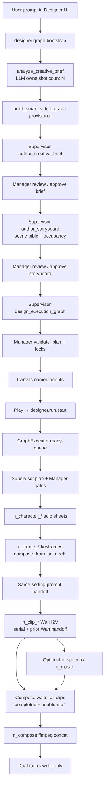

# Designer video pipeline — DETAIL

Reproduce the AI-first **prompt → film** Play path (quality graph
`designer.graph.smart_video.quality.v5`) as running on branch `design`.

This file documents architecture, **pipeline roles**, **agent spawning**,
**scene bible / hierarchical views**, locks, audio routing, scheduling, LLM
shot budgeting, compose readiness, and how to run the stack.

Short companion notes: `a.md`.

---

## 0. End-to-end workflow (user prompt → final film)



**Continuity (code truth):** every keyframe **composes from character solo
sheets** (`compose_from_solo_refs`). First KF of a `setting_id` authors the
**scene bible + master prompt**. Later same-setting KFs still compose from
solos; they soft-depend on the master for **prompt handoff only** (not as an
image-edit source). Camera may change (`view_key`). **No empty scene plates.**

**Shot count:** the Supervisor LLM owns `target_shot_count` (prefer ≤8, hard
max 16). Prefer fewer shots: same cast + same setting + continuous motion
(including a pan) = one clip; put camera motion in the Wan I2V prompt. New
shot / keyframe only on hard cut, new setting, wardrobe/prop change, large
pose/framing jump, or on-screen cast change. Explicit user `N-shot` / `N分镜`
is a hard ceiling. Without LLM, heuristic lean is **1 KF + 1 clip**.

---

## 1. What this pipeline does

User prompt (natural language) → Designer execution graph → **one forward Play**:

1. **Supervisor (= Director)** authors **Production Brief** + **Storyboard**,
   decides shot count with Qwen/Wan continuity cues, then (after Manager lock)
   **builds the graph** and assigns **minimal tools**.
2. **Manager (= Producer)** gates Brief/Storyboard vs the user prompt, stamps
   **scene locks**, **prunes nodes that cannot reach `n_compose`**, re-edits
   artifacts, reviews **every leaf media prompt**, and enforces prior-shot
   handoff so completed storyboard actions are not repeated.
3. **Leaf workers** (`NodeAgentHost` DeepAgents) and/or **handlers** produce
   solo cast sheets, setting-compose keyframes, clips, optional speech/music,
   then **compose** a real `.mp4` only after every clip is completed and usable.
4. **Dual rater agents** score the run; feedback JSON is write-only and applied
   only on an explicit **Run again** (`use_prior_feedback`).

Heuristics run **only** when no configured chat model is available.

---

## 2. Pipeline roles (what each node does)

| Node id pattern | Role | Type | Job |
|-----------------|------|------|-----|
| `n_brief` | `brief` | text | Production brief: story, tone, duration, audio intent |
| `n_storyboard` | `storyboard` | table/text | Beat sheet: timeline, camera, action, on_screen / offscreen, cast_actions |
| `n_character` / `n_character_*` | `character_design` | image | Solo identity sheet per named human (wardrobe locked) |
| `n_frame_*` | `frame` / `keyframe` | image | Still for shot *i* — compose solos into scene; scene master + handoff |
| `n_clip_*` | `clip` | video | Wan I2V from keyframe; motion + camera only; serial film order |
| `n_speech` | `speech` | audio | Optional TTS bed when backend + brief request it |
| `n_music` | `music` | audio | Optional BGM bed when backend + brief request it |
| `n_compose` | `compose` | video | ffmpeg concat of **all** clips (+ mux speech/music); hard-waits media |

**Canvas labels** (`node_labels.py`): `Brief: …`, `Story Board: …`,
`Character N: …`, `Scene S: Shot K: <2–4 word beat>`, `Scene S: Clip K: …`,
`Final Composed: …` — never generic `Image N` / `Video N`.

**Orchestrators (not graph nodes):**

| Agent | Responsibility |
|-------|----------------|
| Supervisor | Brief, storyboard, shot budget, graph redesign, plan directives |
| Manager | Approve/edit gates, prune, scene locks, leaf prompt gate, dual rate |
| Leaf DeepAgent | Per-node tools: `call_model`, `call_image_model`, `call_video_model`, `ffmpeg_compose` |
| Handler | Deterministic media when `delegate=handler` or after agent authors a spec |

---

## 3. Frontend ↔ backend

```
DesignerPage
  └─ Play → designerRunStore.advance()
       (one start for remaining pipeline; auto-resume if pending nodes remain)
  └─ designerGraphClient.startRun / bootstrap
  └─ webClient WebSocket RPC
       designer.graph.bootstrap | designer.run.start | designer.run.get
  └─ AgentServer AdapterRegistry
  └─ DesignerAdapter (gateway_adapter/designer_adapter.py)
       ├─ bootstrap → script_analysis + build_smart_video_graph
       └─ start_run → GraphExecutor.create_run / start_run
  └─ events: DESIGNER_RUN_UPDATED / NODE_UPDATED / GRAPH_UPDATED
  └─ UI bindDesignerRuntime() (+ poll designer.run.get)
```

| Layer | Path |
|-------|------|
| UI client | `jiuwenswarm/channels/web/frontend/src/features/designer/designerGraphClient.ts` |
| Bootstrap UI | `…/designerBootstrapGraph.ts` |
| Run store | `…/designerRunStore.ts` |
| Canvas / labels | `…/designerCanvasNodes.ts`, `DesignerPage.tsx`, `node_labels.py` |
| RPC adapter | `jiuwenswarm/server/runtime/gateway_adapter/designer_adapter.py` |
| Executor | `jiuwenswarm/server/runtime/designer/executor.py` |
| Graph build | `…/smart_graph.py` |
| Orch | `…/orchestration.py` |
| Script / shot budget | `…/script_analysis.py`, `…/experiments/director_contract.py` |
| Leaf DeepAgent | `…/node_agent.py` (`NodeAgentHost`) |
| Compose | `…/handlers/compose.py` |
| Schema / roles | `jiuwenswarm/common/schema/designer_graph.py` |
| Playbook | `…/media_model_playbook.py` |
| Scene policy | `…/experiments/keyframe_policy.py` |

Media and run state live under `JIUWENSWARM_DATA_DIR` or `~/.jiuwenswarm`
(`agent/workspace/`, `agent/designer/graphs|runs|feedback/`).

---

## 4. Quality DAG (v5)

```
n_brief (text)
  → n_storyboard (table)
  → n_character_*  (solo identity sheets only; all before any KF)
  → n_frame_*      (compose_from_solo_refs;
                    first KF/setting = SCENE MASTER prompt+bible;
                    later same setting = prompt handoff + view_key)
  → n_clip_*       (I2V from keyframe; prior clip Wan prompt handoff; serial)
  → n_speech / n_music  (only if TTS/BGM backends exist; else clip-embedded)
  → n_compose      (wait all clips usable → ffmpeg concat + mux)
```

Bootstrap stamp: `metadata.bootstrap = designer.graph.smart_video.quality.v5`.  
`metadata.skip_scene_plate = True` — **no empty environment plates**.  
`metadata.scene_continuity_mode = compose_solos_shared_scene_prompt`.  
`metadata.freeze_shot_topology = False` — Supervisor owns a **flexible**
multi-shot graph; storyboard / LLM `target_shot_count` drives `n_frame_*` /
`n_clip_*`.  
`metadata.all_nodes_agents = True` when LLM is configured.

### Setting / keyframe policy

- **Solo gate:** every named character gets a solo identity card; **all solos
  complete before any keyframe**.
- Group shots by `setting_id`. Occupancy is **per shot**: `on_screen`,
  `offscreen`, `cast_actions`. Offscreen stay **out of the drawing**.
- First KF of a setting: `compose_from_solo_refs` + `is_scene_master`.
  After it completes, `GraphExecutor` hands off `scene_bible` + master prompt
  onto later same-setting frames.
- Later same-setting KF: still `compose_from_solo_refs` from **character
  solos** (not prior-image edit). Soft DAG dep on the master is **prompt
  handoff only**. `view_key` cycles hierarchical coverage.
- New `setting_id` → new scene bible + new compose master.
- **Lock gate:** Manager `review_leaf_media_prompt` injects costume / spatial /
  **SCENE BIBLE** / **SCENE PROMPT HANDOFF** before every frame/clip tool call.

### Hierarchical scene bible (per setting)

| Field | Purpose |
|-------|---------|
| `place` / `architecture` | One coherent geography |
| `lighting` | Stable key direction; no relight mid-scene |
| `objects` | Landmarks / props that exist in every view even if off-camera |
| `crowd` | Density / silhouette lock |
| `views` | `front`, `left`, `right`, `side`, `top`, `bottom` |
| `active_view` | This shot’s camera |
| `coherence_rule` | Nothing pops into existence when the camera moves |

### Prior-shot / clip handoff

- After each **scene-master** frame completes, later same-setting KFs receive
  `scene_master_prompt` + `scene_bible`.
- Clip leaves receive `previous_clip_wan_prompt` + `PRIOR CLIP CONTINUITY`.
- Clips are **serial in film order** (`n_clip_N` depends on `n_clip_{N-1}`).
- Storyboard text syncs into frame/clip configs after the storyboard leaf completes
  (`sync_shot_nodes_from_storyboard_markdown`) so Action / camera stay live.
- `already_done` lists completed storyboard actions so they are not restaged.

### Compose readiness (anti black / 0:00 film)

- Scheduler: compose is **never** a soft artifact dep — waits for every clip
  (+ separate speech/music when present).
- Handler polls until all clip nodes are **completed** with usable mp4
  (size + duration; rejects empty / 0:00 stubs and still→mp4 freezes).
- Agent `ffmpeg_compose` returns blocked if clips are still running.
- Disk fallback only uses `designer_clip_{run_id}*.mp4` — not random
  `generated_*.mp4`.

### Audio

- Probe TTS/BGM at plan time (`detect_audio_backends`).
- Available + Brief wants stems → `n_speech` / `n_music` into compose.
- Missing → `audio_routing.clip_embedded=true`; style folded into clip prompts.
- Compose muxes real audio beds when stems exist.

---

## 5. Agent spawning

| Role | How created | When |
|------|-------------|------|
| **SupervisorAgent** | In-process via `call_model_tool` | Brief / Storyboard → rebuild graph → plan → finalize |
| **ManagerAgent** | Same | Capabilities → lock gate → validate/prune → leaf prompt gate → dual raters |
| **Leaf DeepAgent** | `NodeAgentHost` → `create_deep_agent` | Each ready node with `config.delegate=agent` |
| **Handler** | Role handler class | `delegate=handler` or agent failure / `force_handler` |
| **Rater A / B** | Manager `dual_rate_final` | After film completes |

Leaf tools (minimal per role): `call_model`, `call_image_model`,
`call_video_model`, `ffmpeg_compose`, graph get/patch, `designer_node_complete`.

Concurrency: `_MAX_CONCURRENT_NODE_AGENTS = 3`. Soft deps unlock clip↔clip /
scene-prompt handoff early; compose stays hard.

---

## 6. Scheduling & Play order

`GraphExecutor._execute_wave_run` — continuous ready-queue (no wave barrier).

```
1. Stamp metadata.agent_runtime (ai | heuristic)
2. Skip Enter redesign when supervisor_composed_on_bootstrap
3. Manager.decide_capabilities
4. Supervisor.plan
5. Manager.validate_plan (+ prune / identity stamp)
6. Ready-queue leaves; Manager.review_leaf_media_prompt before each frame/clip
7. Scene-master prompt handoff after first KF of each setting
8. Serial clips + Wan prompt stamp onto next clip
9. Compose only when all clips completed + usable
10. SupervisorReviewer.finalize + Manager.review + dual_rate_final
11. write_run_feedback (apply_on=run_again_only)
```

Duration in the user prompt constrains **total film time / timelines**.
Shot count is LLM-owned (with soft/hard caps above).

---

## 7. Key source files

```
jiuwenswarm/server/runtime/designer/
  smart_graph.py          # build_smart_video_graph (v5 compose + prompt handoff)
  script_analysis.py      # LLM / heuristic creative brief + shot budget
  orchestration.py        # Supervisor / Manager, prune+reedit, leaf prompt gate
  executor.py             # ready-queue, handoff, storyboard→clip sync
  node_agent.py           # NodeAgentHost + ffmpeg_compose gate
  node_labels.py          # Brief / Story Board / Scene Shot|Clip / Final Composed
  model_tools.py          # call_model / image / video tools
  media_model_playbook.py # Qwen / Wan / lock clauses
  experiments/
    keyframe_policy.py    # scene bible, compose-everywhere, hierarchical views
    director_contract.py  # explicit N-shot + infer_shot_budget
    clothing_lock.py / shot_staging_lock.py / clip_prompt_handoff.py / …
  handlers/
    image_nodes.py  clip.py  compose.py  audio_nodes.py  text_nodes.py  common.py

jiuwenswarm/server/runtime/gateway_adapter/designer_adapter.py
jiuwenswarm/common/schema/designer_graph.py
jiuwenswarm/channels/web/frontend/src/features/designer/
jiuwenswarm/agents/harness/common/tools/{image_tools,video_tools,multimodal_config}.py
```

---

## 8. Reproduce locally

### Config

1. Conda/venv with project deps (do **not** commit `.venv` / `Lib/` / `pyvenv.cfg`).
2. `~/.jiuwenswarm/config/.env` with chat + image + video keys as required by Settings.
3. `ffmpeg` on PATH (or `imageio-ffmpeg`) for compose / audio beds.

### UI path

1. `jiuwenswarm-start all` (or stop then `jiuwenswarm-start all`).
2. Open http://127.0.0.1:5173/ → Designer → bootstrap a video prompt → **Play**.
3. Inspect `~/.jiuwenswarm/agent/workspace/` for compose mp4.
4. Canvas labels: `Brief:…`, `Character N:…`, `Scene S: Shot K:…`, `Final Composed:…`.

### Import-level check (no media cost)

```bash
conda run -n new --no-capture-output python -c "from jiuwenswarm.server.runtime.designer.smart_graph import build_smart_video_graph; from jiuwenswarm.server.runtime.designer.orchestration import SupervisorAgent, ManagerAgent; print('ok')"
```

Topology smoke (generic cast; no empty plates; same-setting prompt handoff):

```bash
conda run -n new --no-capture-output python -c "
from jiuwenswarm.server.runtime.designer.experiments.keyframe_policy import apply_compose_solos_setting_policy
from jiuwenswarm.server.runtime.designer.smart_graph import build_smart_video_graph
a=apply_compose_solos_setting_policy({
  'characters':[{'id':'char_1','name':'Alex'},{'id':'char_2','name':'Sam'}],
  'scenes':[{'id':'set_a','name':'Hall'},{'id':'set_b','name':'Street'}],
  'shots':[
    {'shot_index':1,'setting_id':'set_a','on_screen':['char_1'],'action':'speaks'},
    {'shot_index':2,'setting_id':'set_a','on_screen':['char_2'],'action':'exits'},
    {'shot_index':3,'setting_id':'set_b','on_screen':['char_2'],'action':'outside'},
  ],
})
g=build_smart_video_graph(project_id='t',prompt='hall then street',analysis=a,ai_mode=False)
ids=[n['id'] for n in g['nodes']]
assert 'n_scene' not in ids
assert g['metadata']['scene_continuity_mode']=='compose_solos_shared_scene_prompt'
by={n['id']:n for n in g['nodes']}
assert by['n_frame_2']['config']['keyframe_strategy']=='compose_from_solo_refs'
assert by['n_frame_2']['config'].get('scene_prompt_handoff_from')=='n_frame_1'
print('topology_ok', ids)
"
```

---

## 9. Git / tag

- Branch: `design` → `https://github.com/fhfuih/jiuwenswarm/tree/design`
- Docs: `DETAIL.md`, `a.md`
- Quality milestone stamp: **`designer.graph.smart_video.quality.v5`**
- Continuity stamp: **`compose_solos_shared_scene_prompt`**

Do not commit: videos, PNGs/JPEGs from runs, workspace media, `pipeline_*_out/`,
`results_eval/`, trajectory dumps, `_smoke_*` / `_tmp_*` scripts, unit-test-only
fixtures that are not required to run the UI, `.venv` / `Lib/` / `pyvenv.cfg`.

---

## 10. Troubleshooting

| Symptom | Check |
|---------|--------|
| Heuristic-only / 1-shot lean | No chat model → expected; configure Settings / `.env` |
| Too many / too few shots | LLM `target_shot_count`; explicit N-shot; soft ≤8 hard 16 |
| Run stops; UI shows Continue | Ready-queue path; pending nodes auto-resume |
| Empty scene plates | `skip_scene_plate` / bootstrap v5 |
| Architecture drifts | `scene_bible` + SCENE PROMPT HANDOFF + Manager leaf gate |
| Wrong people in a shot | per-shot `on_screen` / `offscreen` / `cast_actions` |
| Clip unrelated to storyboard | storyboard sync + `build_clip_prompt` grounding |
| Black / 0:00 final film | compose wait for completed usable clips; check clip mp4 duration |
| Silent film when sound requested | `audio_routing`; TTS/BGM or clip-embedded |
| still freezes as clips | `allow_still_clip_fallback` must be false |
| Generic node titles | `node_labels` + analysis names |
