# Designer video pipeline — DETAIL

Reproduce the AI-first **prompt → film** Play path (quality graph
`designer.graph.smart_video.quality.v5`) as currently running on branch `design`.

This file is the full reproduction guide: architecture, **agent spawning**,
**scene bible / hierarchical views**, locks, audio routing, scheduling, LLM
roles, media honesty, node naming, and how to run a validation pass.

Short companion notes: `a.md`.

---

## 0. End-to-end workflow (user prompt → film)

```mermaid
flowchart TD
  U["User prompt in Designer UI"] --> BOOT["designer.graph.bootstrap"]
  BOOT --> SA["script_analysis.analyze_creative_brief<br/>cast / scenes / shots / occupancy"]
  SA --> POL["apply_compose_solos_setting_policy<br/>scene_bible + hierarchical views"]
  POL --> G0["build_smart_video_graph v5<br/>skip_scene_plate=true"]
  G0 --> UI["Canvas: named agents<br/>character: Name / scene n: keyframe n / clip n"]
  UI --> PLAY["Play → designer.run.start"]
  PLAY --> SCH["GraphExecutor._execute_wave_run<br/>ready-queue + concurrency 3"]
  SCH --> DIR["Supervisor Director"]
  DIR --> BR["author_creative_brief"]
  BR --> M1["Manager review_brief"]
  M1 --> SB["Supervisor author_storyboard<br/>scene bible: objects, lighting, crowd, views"]
  SB --> M2["Manager review_storyboard lock"]
  M2 --> DG["Supervisor design_execution_graph"]
  DG --> PL["Supervisor.plan tools"]
  PL --> MV["Manager.validate_plan prune + re-edit"]
  MV --> Q["Ready queue"]
  Q --> SOLO["All solo character sheets"]
  SOLO --> KF1["First KF per setting_id<br/>SCENE MASTER compose from solos"]
  KF1 --> HO["Prompt handoff: scene_master_prompt + scene_bible"]
  HO --> KF2["Later same-setting KFs<br/>compose_from_solo_refs + view lock"]
  KF2 --> CLIP["n_clip_* I2V from keyframe"]
  CLIP --> AUD["n_speech / n_music if backends else clip-embedded"]
  AUD --> FILM["n_compose ffmpeg"]
  FILM --> RATE["Dual raters write-only"]
  RATE --> FB["feedback JSON apply_on=run_again_only"]
```



**Continuity rule (current):** every keyframe **composes from character solo
sheets**. First KF of a `setting_id` authors the **scene bible + master prompt**.
Later same-setting KFs wait on that master **only for prompt handoff** (not as
an image-edit source). Camera may change (`view_key`: front / left / right /
side / top / bottom) so objects do not pop in from nowhere. **No empty scene
plates.** **No `edit_prior_keyframe` as the default.**

---

## 1. What this pipeline does

User prompt (natural language) → Designer execution graph → **one forward Play**:

1. **Supervisor (= Director)** authors **Production Brief** + **Storyboard
   Scenario** (hierarchical scenes → keyframes, with a detailed scene bible),
   then (after Manager lock) **builds the graph** and assigns **minimal tools**.
2. **Manager (= Producer)** gates Brief/Storyboard vs the user prompt, stamps
   **scene locks** (objects, lighting, crowd, hierarchical views) so later
   prompts are nearly deterministic, **prunes nodes that cannot reach
   `n_compose`**, **re-edits Brief / Storyboard / locks / graph**, reviews
   **every leaf media prompt**, and enforces **prior-shot prompt handoff** so
   completed storyboard actions are not repeated.
3. **Leaf workers** (`NodeAgentHost` DeepAgents) and/or **handlers** produce
   solo cast sheets, setting-compose keyframes, clips, optional speech/music,
   then **compose** a real `.mp4`.
4. **Dual rater agents** score the run; feedback JSON is write-only and applied
   only on an explicit **Run again** (`use_prior_feedback`).

Heuristics run **only** when `llm_available()` is false (no Settings chat model).

---

## 2. Frontend ↔ backend

```
DesignerPage
  └─ Play → designerRunStore.advance()
       (one start for remaining pipeline; auto-resume if pending nodes remain)
  └─ designerGraphClient.startRun / bootstrap
  └─ webClient WebSocket RPC
       designer.graph.bootstrap | designer.run.start | designer.run.get
  └─ AgentServer AdapterRegistry
  └─ DesignerAdapter (gateway_adapter/designer_adapter.py)
       ├─ bootstrap → script_analysis + build_smart_video_graph
       └─ start_run → GraphExecutor.create_run / start_run
  └─ events: DESIGNER_RUN_UPDATED / NODE_UPDATED / GRAPH_UPDATED
  └─ UI bindDesignerRuntime() (+ poll designer.run.get)
```

| Layer | Path |
|-------|------|
| UI client | `jiuwenswarm/channels/web/frontend/src/features/designer/designerGraphClient.ts` |
| Run store | `…/designerRunStore.ts` |
| Canvas / labels | `…/designerCanvasNodes.ts`, `DesignerPage.tsx` |
| RPC adapter | `jiuwenswarm/server/runtime/gateway_adapter/designer_adapter.py` |
| Executor | `jiuwenswarm/server/runtime/designer/executor.py` |
| Graph build | `…/smart_graph.py` |
| Orch | `…/orchestration.py` |
| Leaf DeepAgent | `…/node_agent.py` (`NodeAgentHost`) |
| Schema / roles | `jiuwenswarm/common/schema/designer_graph.py` |
| Playbook | `…/media_model_playbook.py` |
| Scene policy | `…/experiments/keyframe_policy.py` |

Media and run state live under `JIUWENSWARM_DATA_DIR` or `~/.jiuwenswarm`
(`agent/workspace/`, `agent/designer/graphs|runs|feedback/`).

---

## 3. Quality DAG (v5)

```
n_brief (text)
  → n_storyboard (table)
  → n_character_*  (solo identity sheets only)
  → n_frame_*      (ALL compose_from_solo_refs;
                    first KF/setting = SCENE MASTER prompt+bible;
                    later same setting = prompt handoff + view_key)
  → n_clip_*       (I2V from keyframe; prior clip prompt handoff)
  → n_speech / n_music  (only if TTS/BGM backends exist; else clip-embedded)
  → n_compose      (ffmpeg concat + mux)
```

Bootstrap stamp: `metadata.bootstrap = designer.graph.smart_video.quality.v5`.  
`metadata.skip_scene_plate = True` — **no empty environment plates**.  
`metadata.scene_continuity_mode = compose_solos_shared_scene_prompt`.  
`metadata.freeze_shot_topology = False` — Supervisor owns a **flexible**
multi-shot graph; storyboard shot count drives `n_frame_*` / `n_clip_*`.  
`metadata.all_nodes_agents = True` when LLM is configured — every leaf is a
DeepAgent with tools (handlers materialize media after the agent authors the spec).

### Setting / keyframe policy

- **Solo gate:** every named character gets a solo identity card; **all solos
  complete before any keyframe**.
- Group shots by `setting_id`. Occupancy is **per shot**: `on_screen`,
  `offscreen`, `cast_actions` (doing). Offscreen stay **out of the drawing**.
- First KF of a setting: `compose_from_solo_refs` + `is_scene_master`.
  This still **and its generate.prompt** are the scene master. After it
  completes, `GraphExecutor._handoff_scene_prompt_after_frame` copies
  `scene_bible` + master prompt onto later same-setting frames.
- Later same-setting KF: still `compose_from_solo_refs` from **character
  solos** (not prior-image edit). Soft DAG dep on the master is **prompt
  handoff only**. `view_key` cycles hierarchical coverage.
- New `setting_id` → new scene bible + new compose master. Never borrow
  another setting’s architecture.
- **Lock gate:** Manager `review_leaf_media_prompt` injects costume / spatial /
  **SCENE BIBLE** / **SCENE PROMPT HANDOFF** before every frame/clip tool call.

### Hierarchical scene bible (per setting)

Stamped in `build_scene_bible_for_setting` and Manager-cohered:

| Field | Purpose |
|-------|---------|
| `place` / `architecture` | One coherent geography |
| `lighting` | Stable key direction; no relight mid-scene |
| `objects` | Landmarks / props that exist in **every** view even if off-camera |
| `crowd` | Density / silhouette lock |
| `views` | `front`, `left`, `right`, `side`, `top`, `bottom` |
| `active_view` | This shot’s camera |
| `coherence_rule` | Nothing pops into existence when the camera moves |

Supervisor authors this at storyboard time; Manager ensures all leaf prompts
respect it. Different shots in the **same** scene **must** change view/cast,
not the set.

### Prior-shot prompt handoff

- After each **scene-master** frame completes, later same-setting KFs receive
  `scene_master_prompt` + `scene_bible`.
- Clip leaves also receive `previous_clip_wan_prompt` + `PRIOR CLIP CONTINUITY`.
- Manager `review_leaf_media_prompt` runs before every frame/clip media call.
- `already_done` lists completed storyboard actions (exits, lines) so they are
  not restaged.

### Node names (canvas)

Labels / `agent_name` (cast names come from LLM analysis when available):

- `character: [Name]`
- `scene [n]: keyframe [m] · [featured] · [view_key]`
- `scene [n]: clip [m]`

### Audio

- Probe TTS/BGM at plan time (`detect_audio_backends`).
- Available + Brief wants stems → `n_speech` / `n_music` into compose.
- Missing → `audio_routing.clip_embedded=true`; style folded into clip prompts;
  placeholder audio nodes pruned.
- Compose muxes real audio beds when stems exist.

### Manager prune + artifact re-edit

`_manager_prune_and_cohere` + `_manager_reedit_artifacts_after_prune`:

- Drop nodes with no path to `n_compose`.
- Rewire remaining DAG.
- Re-edit `approved_brief`, `approved_storyboard`, `script_analysis.shots`,
  occupancy, scene locks, and `already_done`.

---

## 4. Agent spawning (critical)

### 4.1 Who spawns what

| Role | How it is created | When |
|------|-------------------|------|
| **SupervisorAgent (Director)** | In-process; LLM via `call_model_tool` | Brief/Storyboard → rebuild graph → `plan` → finalize |
| **ManagerAgent (Producer)** | Same | Capabilities → lock gate → validate/prune/re-edit → leaf prompt gate → dual raters |
| **Leaf DeepAgent** | `NodeAgentHost` → openjiuwen `create_deep_agent` | Each ready node with `config.delegate=agent` |
| **Handler** | Role handler class | `delegate=handler` or agent failure / `force_handler` |
| **Rater A / B** | Manager `dual_rate_final` | After film completes |

Supervisor / Manager are **not** graph nodes. Leaves are workers.

### 4.2 Leaf agent tools

Minimal per role (image-only / video-only / ffmpeg-only). DeepAgents get flat
`**kwargs` LocalFunctions: `call_model`, `call_image_model`, `call_video_model`,
`ffmpeg_compose`, graph get/patch, `designer_node_complete`.

`apply_runtime_delegate(graph)` sets `delegate=agent` when `llm_available()`,
except `force_handler=True` (compose ffmpeg; optional speech/music handlers).

Empty `call_model_tool` responses retry once (`model_tools.py`).

### 4.3 Spawn trigger (ready-queue)

A leaf is **spawned** only when all **data-edge** predecessors are completed, a
concurrency slot is free (`_MAX_CONCURRENT_NODE_AGENTS = 3`), and the node is
not in-flight. Sync/Align groups must not require a node to wait on **itself**
(`_is_ready` skips self in the group).

**Scheduler note (Continue stall):** all Play runs use `_execute_wave_run`
(continuous ready-queue). The old agent-spawn scheduler could drop ready nodes
past the concurrency cap (`too many concurrent node agents`) and leave the run
idle with pending work — UI showed **Continue**. Leaf agents still run via
`delegate=agent` inside `_run_single_node`. If a prior wave still left pending
nodes, the UI auto-resumes once.

---

## 5. Scheduling

Implemented in `GraphExecutor._execute_wave_run`:

| Knob | Value / behavior |
|------|------------------|
| Model | Continuous **ready-queue** (no wave barrier) |
| Leaf concurrency | `_MAX_CONCURRENT_NODE_AGENTS = 3` |
| Image API concurrency | Global semaphore **2** |
| Loops | **Forbidden** — one forward pass |
| Topology | `freeze_shot_topology=False` (+ one Supervisor rebuild after Manager lock) |
| Mid-pass gates | After storyboard leaf: manager review once; after keyframes: clip adjust once |
| Scene prompt handoff | After each scene-master frame completes |

Normalize (`drop_keyframe_to_keyframe_deps`) **keeps** declared
`scene_prompt_handoff_from` / `scene_master_frame_id` edges so later KFs wait
for the master prompt without treating the prior still as an edit source.

---

## 6. LLM orchestration (detail)

### Play-time order (video + LLM)

```
1. Stamp metadata.agent_runtime (ai | heuristic)
2. Optional one-time LLM rebuild if pending_llm_analysis
3. Manager.decide_capabilities
4. Supervisor.author_creative_brief → Manager.review_brief
5. Supervisor.author_storyboard → Manager.review_storyboard (lock + scene bible)
6. Supervisor.design_execution_graph (LLM expands multi-shot topology)
7. Supervisor.plan (minimal tools / node directives)
8. Manager.validate_plan (prune + Brief/SB/lock re-edit + identity stamp)
9. Ready-queue leaves; Manager.review_leaf_media_prompt before each frame/clip
10. Scene-master prompt handoff after first KF of each setting
11. Prior clip Wan-prompt handoff
12. SupervisorReviewer.finalize + Manager.review + dual_rate_final
13. write_run_feedback (apply_on=run_again_only)
```

Duration in the user prompt constrains **total film time / timelines**, not
shot count. A short film can still have many keyframes.

### Script analysis

`script_analysis.analyze_creative_brief(prompt, use_llm=True)` → cast, scenes,
shots (`on_screen` / `offscreen` / `cast_actions`), audio intent. Async-first;
empty LLM JSON retries. `build_smart_video_graph` stamps `setting_id` and
applies `apply_compose_solos_setting_policy`.

### Media honesty

| Rule | Location |
|------|----------|
| `.md` / text never counts as image or video | `node_agent._ref_media_family` |
| Primary image `output_ref` required for char/frame | `node_agent._result_satisfies_required_media` |
| Keyframe image refs = user refs + **solos only** | `handlers/common.collect_frame_reference_images` |
| still→mp4 only if `allow_still_clip_fallback` (default **false**) | `handlers/clip.py` |
| All shot clips must reach compose | `handlers/compose.collect_clip_video_paths` |
| Compose muxes speech/music when present | `handlers/compose.mix_compose_soundtrack` |

---

## 7. Key source files

```
jiuwenswarm/server/runtime/designer/
  smart_graph.py          # build_smart_video_graph (v5 compose + prompt handoff)
  script_analysis.py      # LLM / heuristic creative brief
  orchestration.py        # Supervisor / Manager, prune+reedit, leaf prompt gate
  executor.py             # ready-queue, lock→rebuild→plan→run, scene prompt handoff
  node_agent.py           # NodeAgentHost + already_done / prior prompt context
  model_tools.py          # call_model / image / video tools + empty retry
  media_model_playbook.py # Qwen / Wan / storyboard / lock clauses
  user_references.py      # optional user image refs
  skills_loader.py
  experiments/
    keyframe_policy.py    # scene bible, compose-everywhere, hierarchical views
    clip_prompt_handoff.py
    axis_locks.py
    wan_call_locks.py
    ...
  handlers/
    image_nodes.py  clip.py  compose.py  audio_nodes.py  text_nodes.py  common.py

jiuwenswarm/server/runtime/gateway_adapter/designer_adapter.py
jiuwenswarm/common/schema/designer_graph.py
jiuwenswarm/channels/web/frontend/src/features/designer/
```

---

## 8. Reproduce locally

### Config

1. Conda/venv with project deps (do **not** commit `.venv` / `Lib/` / `pyvenv.cfg`).
2. `~/.jiuwenswarm/config/.env` with chat + image + video keys as required by Settings.
3. `ffmpeg` on PATH (or `imageio-ffmpeg`) for compose / audio beds.

### UI path

1. `jiuwenswarm-start all` (or `--restart default`).
2. Open http://127.0.0.1:5173/ → Designer → bootstrap a video prompt → **Play**.
3. Inspect `~/.jiuwenswarm/agent/workspace/` for compose mp4.
4. Canvas nodes should read `character: …`, `scene n: keyframe …`, `scene n: clip …`.

### Import-level check (no media cost)

```bash
conda run -n new --no-capture-output python -c "from jiuwenswarm.server.runtime.designer.smart_graph import build_smart_video_graph; from jiuwenswarm.server.runtime.designer.orchestration import SupervisorAgent, ManagerAgent, _manager_prune_and_cohere; print('ok')"
```

Topology smoke (no empty plates; same-setting compose + prompt handoff):

```bash
conda run -n new --no-capture-output python -c "
from jiuwenswarm.server.runtime.designer.experiments.keyframe_policy import apply_compose_solos_setting_policy
from jiuwenswarm.server.runtime.designer.smart_graph import build_smart_video_graph
a=apply_compose_solos_setting_policy({
  'characters':[{'id':'char_1','name':'Preacher'},{'id':'char_2','name':'Man'}],
  'scenes':[{'id':'set_church','name':'Church'},{'id':'set_street','name':'Street'}],
  'shots':[
    {'shot_index':1,'setting_id':'set_church','on_screen':['char_1'],'action':'preach'},
    {'shot_index':2,'setting_id':'set_church','on_screen':['char_2'],'action':'leaves'},
    {'shot_index':3,'setting_id':'set_street','on_screen':['char_2'],'action':'outside'},
  ],
})
g=build_smart_video_graph(project_id='t',prompt='church then street',analysis=a,ai_mode=False)
ids=[n['id'] for n in g['nodes']]
assert 'n_scene' not in ids
assert g['metadata']['scene_continuity_mode']=='compose_solos_shared_scene_prompt'
by={n['id']:n for n in g['nodes']}
assert by['n_frame_2']['config']['keyframe_strategy']=='compose_from_solo_refs'
assert by['n_frame_2']['config'].get('scene_prompt_handoff_from')=='n_frame_1'
assert 'n_frame_1' in (by['n_frame_2']['config'].get('inputs') or [])
assert by['n_character_1']['label'].startswith('character:')
print('topology_ok', ids)
"
```

---

## 9. Git / tag

- Branch: `design` → `https://github.com/fhfuih/jiuwenswarm/tree/design`
- Docs: `DETAIL.md`, `a.md`
- Quality milestone stamp: **`designer.graph.smart_video.quality.v5`**
- Continuity stamp: **`compose_solos_shared_scene_prompt`**

Do not commit: videos, `pipeline_ab_out/`, `pipeline_validation_out/`,
`pipeline_test_out/`, `results_eval/`, trajectory dumps, `_smoke_*` / `_tmp_*`
scripts, `.venv` / `Lib/` / `pyvenv.cfg`, or accidental Windows venv binaries.

---

## 10. Troubleshooting

| Symptom | Check |
|---------|--------|
| Heuristic-only run | `llm_available()`, dotenv, Settings chat model |
| Empty LLM JSON / pending analysis | `call_model_tool` empty retry; `script_analysis` async-first |
| Run stops; UI shows Continue | Ready-queue path (`_execute_wave_run`); pending nodes auto-resume |
| Empty scene plates still appear | `skip_scene_plate` / bootstrap v5 |
| Architecture drifts across same-scene shots | `scene_bible` + `SCENE PROMPT HANDOFF` + Manager leaf gate |
| Objects appear when camera changes | hierarchical `views` + `coherence_rule` |
| Wrong people in a shot | per-shot `on_screen` / `offscreen` / `cast_actions` |
| Repeated exits / dialogue | `already_done` + prior prompt handoff |
| Orphan nodes after prune | `_manager_prune_and_cohere` + artifact re-edit |
| Silent film when sound requested | `audio_routing`; TTS/BGM backends or clip-embedded |
| still freezes as clips | `allow_still_clip_fallback` must be false |
| Generic node titles | labels from analysis names + `scene n: keyframe/clip` |
