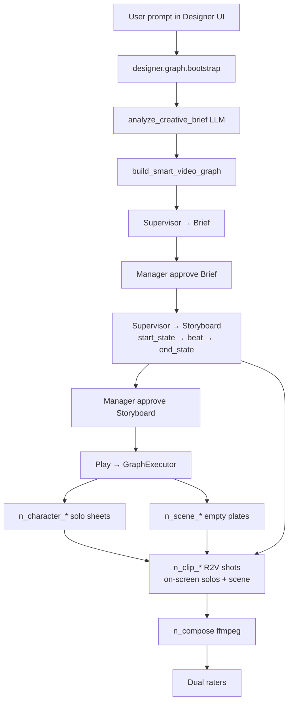
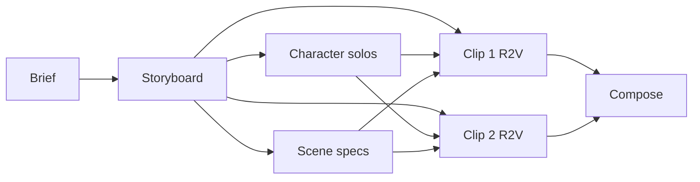

**JiuwenSwarm Designer — AI-first short-film pipeline (no keyframes)**

Branch: `design-no-keyframes-2.0` (from Design-no-keyframes). Target remote:
[`AI-Framework-leibniz/DesignSwarm`](https://github.com/AI-Framework-leibniz/DesignSwarm).

Full reproduction notes: [`DETAIL.md`](./DETAIL.md) · short map: [`a.md`](./a.md) ·
module map: [`jiuwenswarm/server/runtime/designer/README.md`](./jiuwenswarm/server/runtime/designer/README.md) ·
per-node docs: [`designer/docs/INDEX.md`](./jiuwenswarm/server/runtime/designer/docs/INDEX.md).

---

## Pipeline at a glance (user prompt → film)

**No per-shot keyframes.** Clips *are* the shots. Continuity is:

1. **Storyboard** per-shot `start_state` → action/camera/speech → `end_state` (sole plot authority)
2. **Solo identity sheets** (face + wardrobe) — only **on-screen** solos wire into each clip
3. **Scene specs** per `setting_id` (room only — no people)
4. **R2V** clip: attach on-screen solos + scene specs; **story-form** prompt
5. **Same-setting clips run concurrently** once shared deps are ready (no clip→clip edges)
6. **Compose** hard-waits real on-disk clip/audio media

---

## Who does what (agents)

| Agent | Role | Owns |
|-------|------|------|
| **Supervisor** (= Director) | Creative authority | Brief, storyboard (incl. start/end states), shot budget, graph redesign, plan directives |
| **Manager** (= Producer) | Gates & locks | Approve/edit brief & storyboard, prune dead nodes, stamp locks, **rewrite every leaf video prompt** into concise story form, dual ratings |
| **Leaf DeepAgent** (`NodeAgentHost`) | Per-node craft | `call_model` / `call_image_model` / `call_video_model` / `ffmpeg_compose` |
| **Handler** | Deterministic media | Runs when `delegate=handler` or after the agent authors a media spec |

Concurrency: **3** leaf agents. Same-setting clips unlock **together** when storyboard + needed solos + scene are ready. Compose stays hard (on-disk media).

---

## Graph nodes (canvas)

| Node | File(s) | Job |
|------|---------|-----|
| `n_brief` | `handlers/text_nodes.py` | Production brief + lock bible |
| `n_storyboard` | `handlers/text_nodes.py` | Timed windows: start/end state, setting, occupancy, camera, speech |
| `n_character_*` | `handlers/image_nodes.py` | Solo identity stills (plain backdrop) |
| `n_scene_*` | `handlers/image_nodes.py` | Empty environment plate per setting |
| `n_clip_*` | `handlers/clip.py` + `node_agent.py` | R2V shot (Wan / Seedance / MiniMax) |
| `n_speech` / `n_music` | `handlers/audio_nodes.py` | Optional stems |
| `n_compose` | `handlers/compose.py` | ffmpeg concat + mux |

Orchestration / graph build: `orchestration.py`, `smart_graph.py`, `executor.py`,
`script_analysis.py`. Schema: `common/schema/designer_graph.py`.

Per-node detail: [`docs/BRIEF.md`](./jiuwenswarm/server/runtime/designer/docs/BRIEF.md) ·
[`STORYBOARD`](./jiuwenswarm/server/runtime/designer/docs/STORYBOARD.md) ·
[`CHARACTER`](./jiuwenswarm/server/runtime/designer/docs/CHARACTER.md) ·
[`SCENE`](./jiuwenswarm/server/runtime/designer/docs/SCENE.md) ·
[`CLIP`](./jiuwenswarm/server/runtime/designer/docs/CLIP.md) ·
[`ORCHESTRATORS`](./jiuwenswarm/server/runtime/designer/docs/ORCHESTRATORS.md).

---

## Clip prompt contract (story form, positive only)

Locks live on the **node**. Continuity lore lives on the **storyboard row**.
The video API body is a concise narrative rewritten by
`pipeline/video_prompt_practice.py` (Manager / Supervisor gate):

- Open from this shot’s `start_state`; end at `end_state`
- Scene as Image N; each **on_screen** cast member from Image k, wearing …, is …
- **Omit exited cast** until the storyboard returns them on_screen
- No forbid lists, no sit/stand examples, no lock banners, no prior-Wan dump on the call

---

## Local run

1. Configure `~/.jiuwenswarm/config/.env` (chat + image + video; e.g. Wan / MiniMax).
2. `jiuwenswarm-start all` (conda env `new` recommended).
3. Open http://127.0.0.1:5173/ → Designer → prompt → **Play**.
4. Media under `~/.jiuwenswarm/agent/workspace/`.

Do **not** commit: run videos/stills, `pipeline_*_out/`, workspace media, `.env`, unit-test outputs.

---

## Docs map

| Doc | Purpose |
|-----|---------|
| This README | High-level Designer pipeline |
| [`DETAIL.md`](./DETAIL.md) | Full reproduction (DAG, locks, scheduling, troubleshooting) |
| [`a.md`](./a.md) | Short frontend↔backend map |
| [`designer/README.md`](./jiuwenswarm/server/runtime/designer/README.md) | Per-file module guide |
| [`designer/docs/`](./jiuwenswarm/server/runtime/designer/docs/) | Per-node + orchestrator pipelines |
| Frontend | [`channels/web/frontend/README_en.md`](./jiuwenswarm/channels/web/frontend/README_en.md) |
