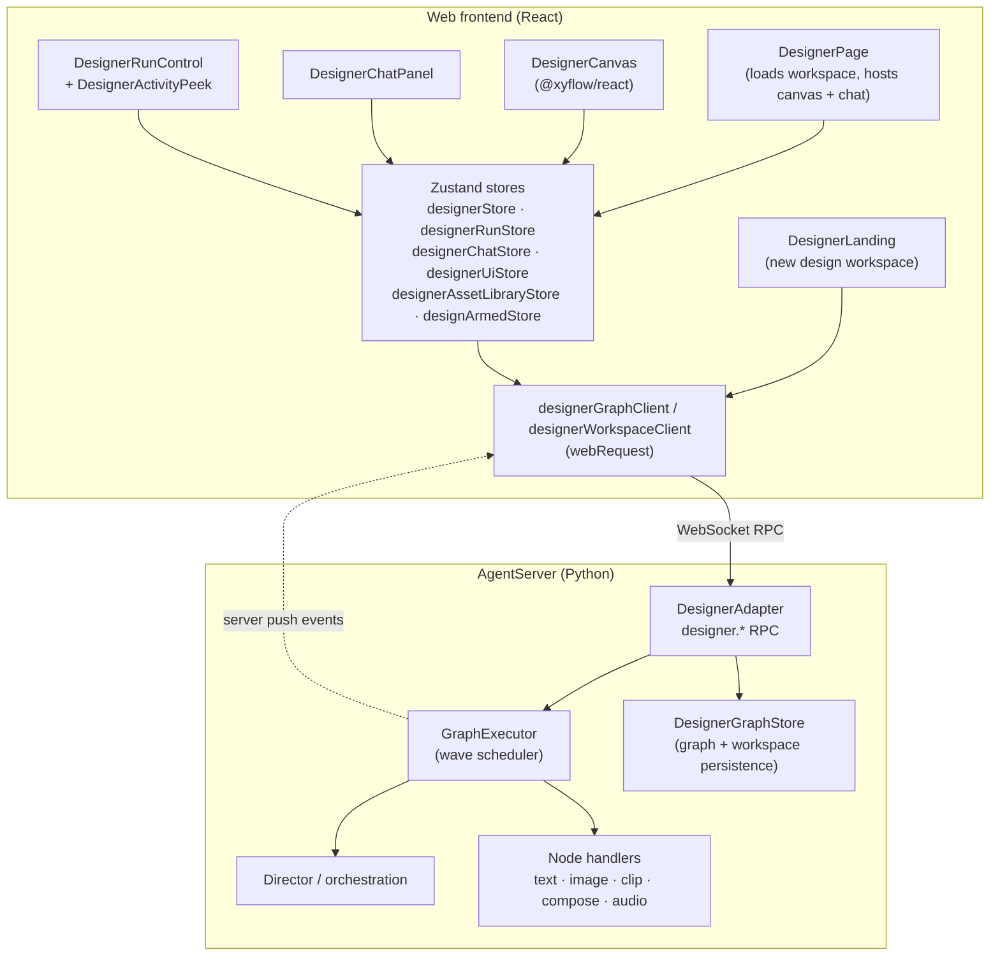
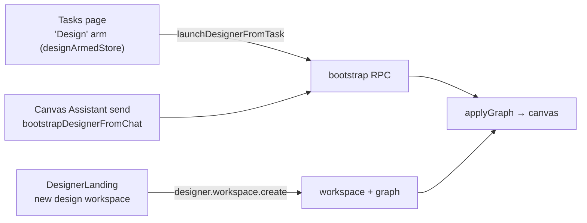
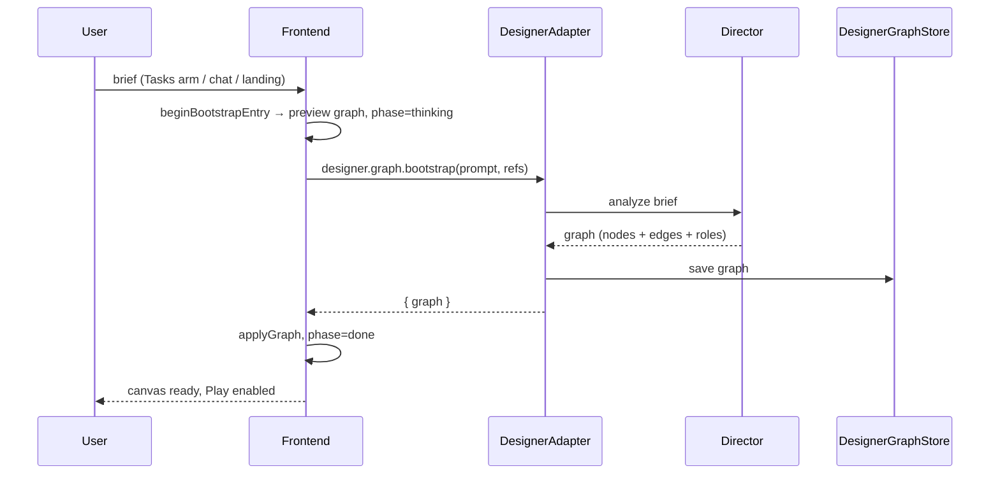

# Design Mode — System Architecture

> Scope: the **Design** work mode (`work_mode = "design"`) surfaced by the Web
> frontend feature `jiuwenswarm/channels/web/frontend/src/features/designer/`
> and its backend counterparts (`designer.*` RPCs in AgentServer, the
> `jiuwenswarm/server/runtime/designer` runtime, and the
> `DesignerExecutionGraph` / `DesignerExecutionRun` wire schema).

Design mode is a **one-project / one-session / one-canvas** workspace: the user
states a creative brief, an agentic **Director** decomposes it into an execution
graph, and the graph is executed wave-by-wave (brief → storyboard → character
solos → scenes → clips → compose) with live canvas updates.

---

## 1. Layering at a glance



Two transport directions are used:

| Direction | Mechanism | Examples |
|-----------|-----------|----------|
| Request/response | `webRequest(method, params)` → `designer.*` RPC | `designer.graph.bootstrap`, `designer.run.start` |
| Server push | `webClient.on(event, handler)` | `designer.run.updated`, `designer.node.updated`, `designer.graph.updated`, `designer.leader.activity` |

The frontend keeps a **400 ms poll** of `designer.run.get` as a fallback while a
run is active, and unsubscribes everything on unmount (`bindDesignerRuntime`).

---

## 2. Entry points

Three ways to reach the canvas — all funnel into the same
`designer.graph.bootstrap` RPC:



| Entry | File | Behaviour |
|-------|------|-----------|
| Tasks page "Design" arm | `designArmedStore.ts` + `designerEntry.ts` | Armed is **per session and one-shot** (`consumeArmed`): the next message is consumed and triggers `launchDesignerFromTask`, which navigates to the Design tab and bootstraps. |
| Canvas Assistant | `designerEntry.ts` → `bootstrapDesignerFromChat` | Same bootstrap path, no navigation; only used when already on the Design page. |
| Landing page | `components/DesignerLanding.tsx` | Collects prompt + model + attachments, calls `designer.workspace.create` with a `create_token`, then hands back `projectId`/`sessionId` to the app router. |
| Chat-driven edits | `designerGraphClient.chat` | `designer.graph.chat` asks the invisible Leader to edit an existing graph (optional `selected_node_id`, `run_new_nodes`). |

`isNewDesignerBrief(text)` distinguishes a fresh film brief (≥ 48 chars and
matches topic keywords) from a small canvas edit so the arm only fires on real
briefs.

Routing is owned by `App.tsx`, which renders `DesignerPage projectId={route.projectId}`
(or `DesignerLanding` when there is no project yet).

---

## 3. Frontend module map

### 3.1 State (Zustand)

| Store | Owns | Key actions |
|-------|------|-------------|
| `designerStore.ts` | `domainGraph`, `graphId`, load/save status, `selectedNodeId` | `loadForProject`, `loadGraph`, `applyGraph`, `addNode/addEdge/addSubgraph`, `updateNodeConfig`, `flushSave` |
| `designerRunStore.ts` | `run`, `nodeStates`, `currentLayerNodeIds`, `isRunning`, `primaryAction`, `leaderActivity` | `advance`, `rerunNode`, `restart`, `cancel`, `chooseOutput`, `resetForGraph`, `bindDesignerRuntime` |
| `designerChatStore.ts` | Chat transcript (`messagesByGraphId`), bootstrap phase | `appendMessage`, `replaceMessages`, `bindGraph`, `ensureGraphPrompt` |
| `designerUiStore.ts` | Ephemeral UI: tool, dock panel, viewer, revision chooser | `inspectNode`, `startEdit`, `openViewer`, `openRevision`, `setCanvasTool` |
| `designerAssetLibraryStore.ts` | Reusable uploaded assets (drag-and-drop palette) | asset CRUD + `DESIGNER_ASSET_DRAG_MIME` drag payload |
| `designArmedStore.ts` | Per-session "Design armed" flag | `setArmed`, `consumeArmed` |

**Save/load discipline:** `designerStore` debounces saves (`SAVE_DEBOUNCE_MS = 500`)
and sequences them with `saveSeq` / `loadSeq` guards. Deleted node IDs are
remembered (`deletedNodeIds`) and stripped from any late-arriving graph so a
stale server snapshot cannot resurrect removed nodes.

### 3.2 Graph ↔ React Flow boundary

| File | Responsibility |
|------|----------------|
| `designerGraphAdapter.ts` | Pure mapping between the domain graph and `@xyflow/react` nodes/edges — keeps React Flow types out of the domain model. |
| `designerCanvasNodes.ts` | Node factory, sizing constants, successor placement, auto-layout, library-asset → node. |
| `designerGraphLoad.ts` | Which graph to open (`localStorage: jiuwenswarm_designer_last_graph_id`), preview-graph filtering, summaries. |
| `designerBootstrapGraph.ts` | `preview_bootstrap` placeholder graph shown while the Director composes (intentionally **empty** — a skeleton would look like a finished workflow). |
| `designerFitView.ts` | Fit-to-view padding for newly loaded graphs. |
| `designerLayerRun.ts` | Pure DAG math: incoming/outgoing maps, root layer, next ready layer, `derivePrimaryAction`. |
| `storyboardShots.ts` | Parses the storyboard node's text (zh/en field aliases) into structured shot rows for the UI. |

### 3.3 Run control & activity

- `designerRunView.ts` — status classification (`active` vs `terminal`),
  failure-message lifting, and `mergeRunStatesIntoNodes` to paint node badges.
- `designerActivity.ts` — normalises `activity_log` / `activity_tail` /
  `activity` into the ≤ 8 lines rendered by the activity peek.
- `components/DesignerRunControl.tsx` + `DesignerActivityPeek.tsx` — Play /
  Continue / Retry / Cancel, plus the Leader's live trace.

### 3.4 Materials & revisions

| File | Responsibility |
|------|----------------|
| `designerMaterials.ts` | `collectDesignerMaterials` / `collectPendingRevisions`, MIME-first output classification, editable-role set (`brief`, `storyboard`). |
| `designerAssetUrl.ts` | Asset URL resolution (`preview`/`text`), local-path → `file:` URI, upload helpers, placeholder detection. |
| `designerNodePreview.ts` | Per-node preview extraction. |
| `DesignerMaterialViewer.tsx` / `DesignerRevisionChooser.tsx` | Full-screen viewer and original-vs-new chooser. |
| `mediaNodeConfig.ts` / `comfyuiWorkflow.ts` / `useComfyuiImport.ts` | Media node parameters and ComfyUI workflow import. |

**Auto-accept rule:** `DesignerPage` promotes every pending revision to `'new'`
automatically — the user is never forced through one-by-one approval.

---

## 4. Wire schema (shared domain contract)

Types live in `executionGraphTypes.ts` and mirror the Python
`jiuwenswarm/common/schema/designer_graph.py`.

```ts
DesignerExecutionGraph {
  schema_version: 'designer-execution-graph.v1'
  graph_id, project_id, title, description, source
  nodes: DesignerGraphNode[]
  edges: DesignerGraphEdge[]
  metadata, created_at, updated_at
}

DesignerExecutionRun {
  schema_version: 'designer-execution-run.v1'
  run_id, graph_id, status,
  node_states: { [nodeId]: DesignerNodeState },
  current_node_ids: string[],
  metadata, error, warning, updated_at
}
```

| Concept | Values |
|---------|--------|
| Node types | `text`, `table`, `image`, `video`, `audio` |
| Node roles | `brief`, `storyboard`, `character_design`, `scene`, `frame`, `clip`, `compose`, `music`, `speech`, + generic type roles |
| Delegates | `handler`, `subagent`, `agent` |
| Node/run statuses | `pending`, `running`, `completed`, `failed` (+ run-level `paused`, `cancelled`) |
| Primary action | `execute`, `continue`, `retry_failed`, `running`, `done` |

The Leader is a non-canvas node addressed by `DESIGNER_LEADER_NODE_ID`; its
`activity` powers the peek panel.

---

## 5. Backend counterparts

### 5.1 RPC surface (`jiuwenswarm/common/schema/message.py` → `ReqMethod`)

| Method | Purpose |
|--------|---------|
| `designer.workspace.create` | Create design project + session + initial graph (idempotent via `create_token` receipt + `_workspace_create_lock`). |
| `designer.workspace.get` | Load workspace (project, session, graph, messages) for a project. |
| `designer.graph.get` / `list` / `save` / `patch` | Graph CRUD; `patch` applies structural edits. |
| `designer.graph.bootstrap` | Director decomposes a prompt into a graph. |
| `designer.graph.chat` | Leader-driven graph edit from natural language. |
| `designer.run.start` / `get` / `pause` / `cancel` / `choose_output` | Run lifecycle and asset revision choice. |

### 5.2 Runtime

| Component | Role |
|-----------|------|
| `server/runtime/gateway_adapter/designer_adapter.py` | RPC entry, workspace receipts/locking, event push (`_push_designer_event`), bootstrap-with-Director. |
| `server/runtime/designer/executor.py` | `GraphExecutor` — wave scheduler, concurrency ≤ 3, storyboard→clip sync, compose hard-wait. |
| `server/runtime/designer/smart_graph.py` | Builds the `quality.v5` DAG (no `n_frame_*`, no clip→clip edges). |
| `server/runtime/designer/script_analysis.py` | LLM cast / scene / shot / occupancy analysis. |
| `server/runtime/designer/orchestration.py` | Director: plan, validate, leaf-prompt rewrite, ratings. |
| `server/runtime/designer/handlers/*` | Deterministic node execution (text, image, clip, compose, audio). |
| `server/runtime/designer/graph_store.py` | Graph + run persistence. |
| `server/runtime/designer/node_agent.py` | Leaf DeepAgent tool surface (`call_image_model`, `call_video_model`, `ffmpeg_compose`). |

See `jiuwenswarm/server/runtime/designer/README.md` and
`jiuwenswarm/server/runtime/designer/docs/INDEX.md` for the per-node pipeline docs.

---

## 6. End-to-end flows

### 6.1 Bootstrap (prompt → canvas)



A missing/failed chat model raises `DesignerLlmError`; there is **no heuristic
film plan fallback**.

### 6.2 Run / advance (Play → waves)

1. `advance()` picks the primary action from `derivePrimaryAction(...)`.
2. `flushSave()` persists the graph before the run starts.
3. `designer.run.start` is called with `graph_id` (fresh), `run_id` (continue)
   or `node_id` (retry single failed node).
4. Server pushes `designer.run.updated` / `designer.node.updated`; the store
   merges states, and polls `designer.run.get` every 400 ms while active.
5. On terminal status the store may `advance()` **once** when there is pending
   work, no failures, and the run is not node-scoped (`metadata.scope_node_ids`).
   Failed nodes are never auto-retried.

### 6.3 Asset revision

Generated outputs that need a decision surface as pending revisions. The page
auto-accepts `'new'` via `designer.run.choose_output`, so runs keep flowing
without manual approval.

---

## 7. Persistence & filesystem

| Artifact | Location |
|----------|----------|
| Design workspaces | `<agent_root>/workspace/design/<directory_name>` |
| Creation receipts (idempotency) | `<agent_root>/designer/workspace_receipts/<sha256(token)>.json` (+ `.lock`) |
| Sessions | standard agent session store (`get_agent_sessions_dir`) |
| Last opened graph | browser `localStorage: jiuwenswarm_designer_last_graph_id` |

Design projects are always `work_mode = "design"`. They are excluded from cron
scheduling (`resolve_cron_project_binding` rejects `design`), and design mode
never folds into the `work`/`code` execution profiles (`EXECUTION_WORK_MODES`).

---

## 8. Invariants worth knowing

- **One canvas per project.** `DesignerPage` loads via `designer.workspace.get`
  and guards races with `workspaceLoadSeqRef` + `bootstrapInProgress`.
- **Deleted nodes stay deleted.** `deletedNodeIds` filters late server snapshots.
- **Preview graphs are not real.** Any `preview_*` graph id is ignored for
  persistence and run binding.
- **The Leader is not a node.** It lives at `DESIGNER_LEADER_NODE_ID` and only
  reports activity.
- **Plan/continue is user-driven**, except the single guarded auto-continue.
- **Bootstrap is idempotent** on the server via the creation-token receipt.
- **Design mode ≠ agent execution mode.** `mode` (agent/code/team) and
  `work_mode` (work/code/design) are orthogonal.

---

## 9. Extension points

| To add… | Touch |
|---------|-------|
| A new node type/role | `executionGraphTypes.ts` + Python `designer_graph.py` + handler in `server/runtime/designer/handlers/` |
| A new RPC | `ReqMethod` + `designer_adapter.py` dispatch + `designerGraphClient` |
| A new push event | `EventType` + `_push_designer_event` + `bindDesignerRuntime` |
| A new canvas panel | `designerUiStore` + `components/DesignerCanvasDock.tsx` |
| New media parameters | `mediaNodeConfig.ts` + `controls/DesignerComfyuiParamsForm.tsx` |
