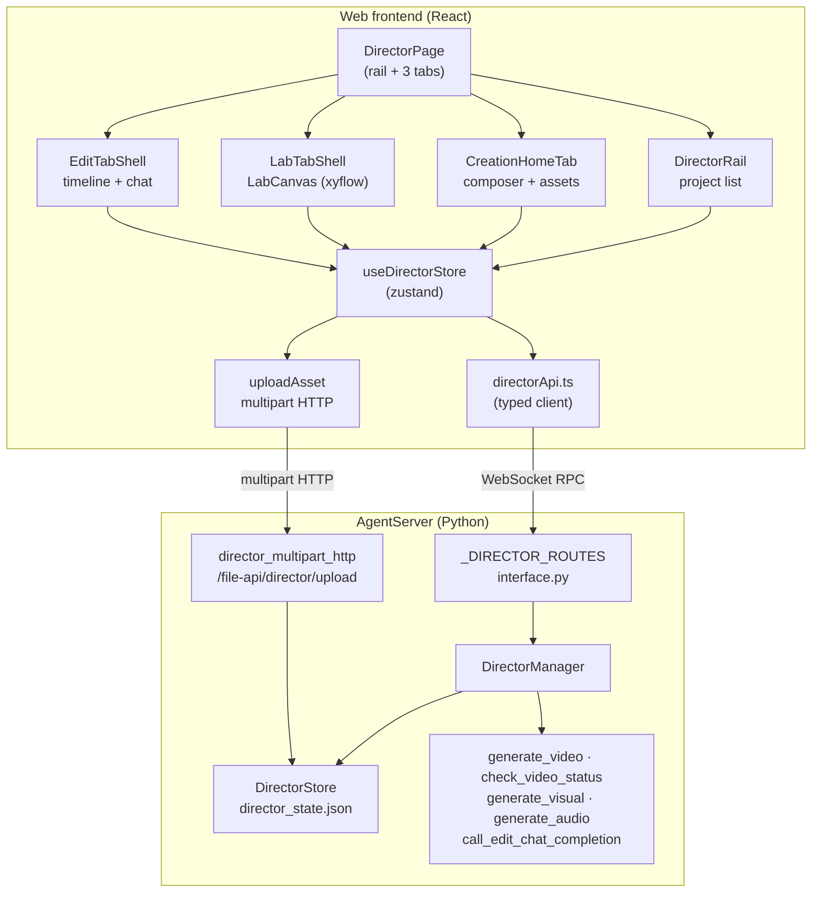
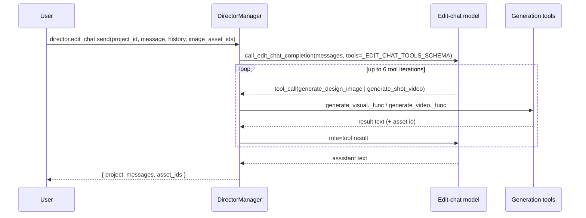

# Director Mode — System Architecture

> Scope: **Director Mode** (导演模式) on branch `videoGenDirector` — the Web
> frontend feature `jiuwenswarm/channels/web/frontend/src/features/director/`
> and its backend counterparts (`director.*` RPC in AgentServer, the
> `jiuwenswarm/server/runtime/director` package, and the `video_gen_tools` /
> `visual_gen_tools` / `audio_gen_tools` / `edit_chat_tools` tool functions).

Director Mode is a **project / asset / canvas** workspace for AI media
production. Unlike Design mode (agentic graph execution), Director Mode calls
generation tools **directly**: the composer form fully determines the tool
arguments, so no LLM turn is inserted between the UI and the generator
(`director_manager.generate_video._func` / `generate_visual._func`).

---

## 1. Layering at a glance



Two transports are used, deliberately:

| Direction | Mechanism | Notes |
|-----------|-----------|-------|
| `director.*` RPC | WebSocket via `webRequest` | All project/asset/generate/edit-chat calls. |
| Asset upload | `POST /file-api/director/upload` (multipart) | A binary body does not fit the JSON RPC envelope; handled by a separate HTTP handler. |
| Status polling | Client-side timer on `director.generate.check_status` | Director Mode has **no server push**; the client polls for long-running video jobs. |

---

## 2. Entry point & navigation

| Item | Value |
|------|-------|
| Nav key | `director` — registered in `components/SessionSidebar/index.tsx` (`nav.director`, "Director" / "导演"). |
| Route | `App.tsx`: `{activeNav === 'director' && <DirectorPage />}` |
| Tabs | `DirectorTabKey = 'create' | 'lab' | 'edit'`, held in `useDirectorStore.activeTab` |

`DirectorPage` renders the project rail plus one tab at a time:

```
DirectorPage
├── DirectorRail            project list, select / new project
├── activeTab === 'create'  → CreationHomeTab    (prompt + params → generate)
├── activeTab === 'lab'     → LabTabShell        (node canvas of process cards)
└── activeTab === 'edit'    → EditTabShell       (timeline + edit chat)
```

`EditTabShell` is remounted on project switch via `key={selectedProject?.project_id ?? 'none'}`
— without it, the per-project timeline state would show the previous project's
data after switching projects while staying on the Edit tab.

---

## 3. Frontend module map

### 3.1 State — `directorStore.ts` (zustand, single store)

| Group | Fields |
|-------|--------|
| Navigation | `activeTab` |
| Projects | `projects`, `projectsLoading`, `projectsError`, `selectedProjectId`, `assetCounts` |
| Composer | `composerMode`, `composerPrompt`, `composerParams` |
| Generation | `generating`, `generateError`, `pendingGeneration` |
| Upload | `uploading`, `uploadError` |
| Edit chat | `editChatDraft`, `editChatPendingImageIds`, `editChatSending`, `editChatError` |
| Session-authoritative copies | `labCanvasByProject`, `editTimelineByProject` |

Two fields exist specifically to avoid remount races:

- **`labCanvasByProject`** — written **synchronously** (no debounce) on every
  node/edge change; the durable save to `director_state.json` is debounced and
  asynchronous. Switching tabs remounts `LabCanvas`, and without the in-memory
  copy it could read a stale `project.lab_nodes`.
- **`editTimelineByProject`** — same reasoning for the Edit tab timeline
  (tracks/clips/undo stack), stored as an opaque `unknown` snapshot.

### 3.2 Client — `directorApi.ts` + `types.ts`

- Every component goes through the typed functions in `directorApi.ts`; nothing
  calls `webRequest` for Director methods directly.
- Responses are normalised (`normalizeProjectsList`, `normalizeProjectResult`,
  `normalizeGenerateResult`) so snake_case wire fields become camelCase.
- Errors are converted to `DirectorApiError`. The backend's `DirectorRpcError.code`
  is promoted to the top-level WS `error.code` by the gateway, then attached to
  `WebError.code` by `webClient`, so the client reads `err.code` directly.
- Timeouts are intentionally generous because the RPC body carries base64
  reference images and the backend may poll internally:

| Call | Timeout | Why |
|------|---------|-----|
| `director.generate` | 300 s (`GENERATE_TIMEOUT_MS`) | `generate_video` polls up to ~120 s internally; first/last-frame refs add base64 upload time. |
| `director.edit_chat.send` | 600 s (`EDIT_CHAT_TIMEOUT_MS`) | A single turn may run several real image/video generations, and `generate_shot_video` blocks until the video completes (up to ~5 min). |

### 3.3 Components

| File | Responsibility |
|------|----------------|
| `components/DirectorRail.tsx` | Project list, selection, new-project entry. |
| `components/NewProjectDialog.tsx` | Project creation form. |
| `components/CreationHomeTab.tsx` | Composer surface: prompt, mode, params, quick-start chips, asset grid. |
| `components/ModeSegmentedControl.tsx` | Switches `ComposerMode`; disabled modes show `ComingSoonBadge`. |
| `components/ComposerCard.tsx` + `ParamPillDropdown.tsx` | Prompt input and aspect/resolution/duration/audio parameters. |
| `components/ProjectGrid.tsx` / `ProjectCard.tsx` | Project browsing. |
| `components/LabTabShell.tsx` | Hosts the Lab canvas + actions context. |
| `lab/LabCanvas.tsx` | `@xyflow/react` canvas of process/image/video/text cards; debounced save. |
| `lab/LabActionsContext.tsx` | Cross-node actions (run a process card, etc.). |
| `lab/nodes/` | Node renderers for the Lab canvas. |
| `components/EditTabShell.tsx` | Timeline shell (tracks, clips, undo) for the Edit tab. Clips are `image` / `video` / `audio`: image clips get a fixed default length, video and audio clips probe the real duration from a media element on drop, and all three can be moved, trimmed (image only, via handles) and split. Audio clips have no thumbnail — they render a note-icon placeholder — and the preview area shows an `<audio controls>` element whose `timeupdate` drives the playhead, exactly like video. |
| `components/EditChatPanel.tsx` | Edit-tab chat assistant (script → designs → shot list → frames → clips). |

### 3.4 Composer modes

| Mode | Backend | Notes |
|------|---------|-------|
| `video` | ✅ `generate_video` | Optional first/last frame references. |
| `image` | ✅ `generate_visual` | Optional multi-reference composition. |
| `character` | ✅ `generate_visual` | Prompt is `"名称: 描述"`; the parsed name becomes the asset name so it can be referenced as `@名称`. |
| `audio` | ✅ `generate_audio` | Text-to-speech. No aspect/resolution pills and no `@名称` references — the prompt is spoken verbatim and a voice is picked from the toolbar. |
| `world` | ❌ | Placeholder ("coming soon"); `ENABLED_COMPOSER_MODES` gates the UI and the backend rejects it with `NOT_SUPPORTED`. |

---

## 4. Wire contract

### 4.1 RPC surface (`ReqMethod` in `common/schema/message.py`)

| Method | Handler | Purpose |
|--------|---------|---------|
| `director.projects.list` | `handle_director_projects_list` | Projects + asset counts. |
| `director.projects.create` | `handle_director_projects_create` | Create project. |
| `director.projects.get` | `handle_director_projects_get` | Load one project. |
| `director.projects.rename` | `handle_director_projects_rename` | Rename project. |
| `director.projects.delete` | `handle_director_projects_delete` | Delete project (+ assets). |
| `director.generate` | `handle_director_generate` | Direct generation for `video` / `image` / `audio` / `character`. |
| `director.generate.check_status` | `handle_director_generate_check_status` | Poll an async video job. |
| `director.asset.rename` | `handle_director_asset_rename` | Rename asset (enables `@name` references). |
| `director.asset.delete` | `handle_director_asset_delete` | Delete asset. |
| `director.edit_chat.send` | `handle_director_edit_chat_send` | Edit-tab chat turn with tool calling. |
| `director.lab_canvas.save` | `handle_director_lab_canvas_save` | Persist Lab canvas `nodes` / `edges`. |

Dispatch happens in `interface.py::_handle_director_request`, registered in
`_DIRECTOR_ROUTES` and invoked in the stateless-request chain **before**
`_ensure_adapter` — Director Mode never builds an Agent, session, or LLM turn
for these calls.

Plus one non-RPC endpoint:

| Endpoint | Handler | Purpose |
|----------|---------|---------|
| `POST /file-api/director/upload` | `director_multipart_http.handle_director_asset_upload_http` | Upload an image/video/audio file as an asset (`asset_type=character` for character refs, `asset_type=audio` for the new 音频 category). |

### 4.2 Error codes (`DirectorRpcError`)

| Code | Meaning |
|------|---------|
| `INVALID_PARAMS` | Missing/blank field, length/content violation. |
| `NOT_SUPPORTED` | Mode not yet implemented (`world`). |
| `NOT_CONFIGURED` | The required model is not enabled/configured in settings. |
| `PROJECT_NOT_FOUND` | Unknown `project_id`. |
| `ASSET_NOT_FOUND` | Unknown `asset_id`. |
| `GENERATION_FAILED` | The provider call failed or returned `[ERROR]`. |

---

## 5. Backend architecture

| Component | Responsibility |
|-----------|----------------|
| `server/runtime/director/director_manager.py` | `DirectorManager` — all `director.*` RPC handlers; validates params; gates on model config; calls generation tools; owns the edit-chat tool loop. |
| `server/runtime/director/director_store.py` | `DirectorStore` — JSON persistence of projects/assets/edit-chat/lab canvas. |
| `server/runtime/director/director_multipart_http.py` | Multipart upload handler for asset files. |
| `agents/harness/common/tools/video_gen_tools.py` | `generate_video`, `check_video_status`, `video_gen_enabled/configured`. |
| `agents/harness/common/tools/visual_gen_tools.py` | `generate_visual`, `visual_gen_enabled/configured`. |
| `agents/harness/common/tools/audio_gen_tools.py` | `generate_audio`, `audio_gen_enabled/configured` (text-to-speech; PCM responses are wrapped into WAV). |
| `agents/harness/common/tools/edit_chat_tools.py` | `call_edit_chat_completion`, `build_multimodal_user_message`, `edit_chat_enabled/configured`. |

### 5.1 `@名称` reference resolution

Assets can be referenced by name in prompts. `DirectorManager._resolve_at_references(project, prompt, max_refs)`
turns `@Name` tokens into real file paths and strips them from the prompt:

| Context | Max refs | Semantics |
|---------|----------|-----------|
| `video` composer | 2 | 1st → first frame, 2nd → last frame. |
| `image` composer | 4 (`_MAX_IMAGE_REFERENCES`) | Multi-reference composition. |
| `generate_design_image` (edit chat) | 4 | Keeps characters/scenes consistent across shots. |

Lab canvas connections are a **separate, mutually exclusive** path: wired
`asset_id`s (`first_frame_asset_id`, `last_frame_asset_id`, `reference_asset_ids`)
are resolved directly and take precedence over text `@name` parsing.

### 5.2 Edit-chat tool loop



- `_EDIT_CHAT_TOOLS_SCHEMA` exposes exactly two tools — deliberately no
  filesystem/network tools, keeping it a scoped design assistant rather than a
  general Agent.
- `_EDIT_CHAT_MAX_TOOL_ITERATIONS = 6`.
- `generate_shot_video` polls internally (10 s × 30 = up to 5 min) so the chat
  never gets a half-finished `pending` asset.
- Generated `asset_id`s are attached to the assistant message so the UI renders
  thumbnails inline.
- There is **no server-side chat session state**: the client resends the whole
  history each turn, which is why the timeout is large.

---

## 6. Data model

Types mirror `director_store.py`.

```ts
DirectorProject {
  project_id, name, created_at, updated_at
  assets: DirectorAsset[]
  edit_chat_messages: EditChatMessage[]
  lab_nodes: Record<string, unknown>[]   // opaque xyflow snapshots
  lab_edges: Record<string, unknown>[]
}

DirectorAsset {
  asset_id, type: 'video' | 'image' | 'audio' | 'character'
  status: 'ready' | 'pending' | 'failed'
  prompt, params, file_path, job_id, error
  name            // user/parsed name; enables "@name" references
  created_at, updated_at
}

EditChatMessage { role: 'user' | 'assistant'; content; image_asset_ids; created_at }
```

**Why Lab canvas is opaque:** node/edge shapes are owned by `@xyflow/react`.
The backend stores them as an untyped dict list — exactly like
`DirectorAsset.params` — so the frontend canvas schema never has to be
duplicated server-side.

Lab process card kinds (`labTypes.ts`):

| `ProcessKind` | Mode | Image ports | Video ports | Audio ports | Notes |
|---------------|------|-------------|-------------|-------------|-------|
| `text2image` | image | 0 | 0 | 0 | |
| `text2video` | video | 0 | 0 | 0 | |
| `image2video` | video | 2 | 0 | 0 | Distinct first/last-frame slots; one edge each. |
| `imageRef` | image | 1 | 0 | 0 | The single port accepts **multiple** edges (multi-reference). |
| `text2audio` | audio | 0 | 0 | 0 | Text-to-speech (`generate_audio`). Text-only: no reference ports, and the params popover swaps aspect/resolution/duration for a voice picker. Its output node is an `audio` node wrapping `<audio controls>`. |
| `video2audio` | audio | 0 | 1 | 0 | 视频生音频: chains two existing capabilities — `video_understanding` writes a narration script from the connected video, then `generate_audio` speaks it. The `video1` port accepts video nodes only, and the optional text node's content is appended to the narration prompt as extra requirements. Its persisted asset is an **`audio`** asset (not `video2audio`) whose `params` carry `script` / `input_video_path`; `buildFlowFromChat` uses `input_video_path` to redraw the dependency edge. Needs **both** the 语音生成 and 视频理解 slots configured. On the wire it is its **own `mode`**: the Lab sends `mode="video2audio"` explicitly (a plain `mode="audio"` would take the TTS-only branch and feed the empty prompt straight to `generate_audio`), and the backend also normalises `mode="audio"` + an input video to it so no client can land in the wrong branch. |
| `imageAudio2video` | video | 1 | 0 | 1 | 图音生视频: one reference-to-video call with **both** references in `input_references` — the image as `image_url` (deliberately *not* a first frame: OpenRouter drops `input_references` when `frame_images` is also present) and the audio as `audio_url`, which the model lip-syncs to. The `audio1` port accepts audio nodes only. Its own `mode` on the wire (`image_audio2video`); the persisted asset is a **`video`** asset whose `params` carry `reference_image_path` / `input_audio_path` / `generate_audio`, and `buildFlowFromChat` redraws both dependency edges from those. The card exposes a 有声音/无声音 picker (`generateAudio`) because Seedance returns a silent clip unless the request asks for audio output, plus an 音频链接 text field: a public HTTPS audio URL can be typed directly as the reference instead of wiring an audio clip, in which case it wins (`input_audio_url` on the wire, `input_audio_path` in `params`) and the 参考音频 row shows 链接 instead of ✓. The field exists because the app can't host local files publicly — the provider must fetch the audio itself. Other provider constraints: OpenRouter only accepts an **HTTPS URL** for an audio reference (base64/data URIs are rejected), and BytePlus rejects reference images containing real people. |

Port capacity is declared by `PROCESS_KIND_MAX_IMAGES` / `PROCESS_KIND_MAX_VIDEOS` /
`PROCESS_KIND_MAX_AUDIOS`,
so adding a port to a new kind is a one-line change plus the matching `<Handle>`
row in `ProcessNode.tsx`.

Output (source) handles are equally load-bearing: a card that is meant to feed a
downstream port **must** render a `source` `<Handle>`. `VideoNode` originally had
only a `target` handle, so the 视频 card could not be dragged into the
视频生音频 card at all — React Flow only starts a connection from a source handle.
It now exposes `id="video"`, and `isValidConnection` restricts each target port to
one source node type (`text` → text, `image1`/`image2` → image, `video1` → video).

Note `directorApi.ts`'s `directorGenerate()` builds the **only** camelCase →
snake_case map for this RPC. Every new `GenerateParams` field must be added there
as well — a field that stays only on the `GenerateParams` interface is silently
dropped on the wire (this is how `voice` and `input_video_asset_id` were lost: the
Lab sent them, the backend never saw them).

---

## 7. Persistence & concurrency

| Artifact | Location |
|----------|----------|
| Director state | `<agent_root>/director/director_state.json` |
| Project directory | `<agent_root>/director/<project_id>/` |
| Asset files | `<agent_root>/director/<project_id>/assets/` |

Concurrency design (three distinct locks, each for a real race):

| Lock | Scope | Protects |
|------|-------|----------|
| `DirectorManager._lock` (`asyncio.Lock`) | WS RPC path | Read-modify-write of `director_state.json` for status updates and edit-chat generations. |
| `director_multipart_http._UPLOAD_LOCK` (`threading.Lock`) | HTTP upload path | The same read-modify-write from the synchronous/threaded handler. A different lock type is required because that path is not async. |
| *(none)* around `director.generate` provider calls | — | Intentional: the lock would serialize independent generation requests at the provider. `DirectorStore._load/_save` contains no `await`, so it is already atomic under the single-threaded event loop. |

**`DirectorStore` never caches.** Every public method re-reads
`director_state.json` from disk. This is a deliberate bug fix, not a
performance choice: `DirectorManager` is a long-lived per-channel instance,
while `/file-api/director/upload` constructs a fresh `DirectorStore` per
request. A constructor-time in-memory snapshot would permanently diverge, so
uploaded assets would be visible in `projects.list` yet fail `rename`/`delete`
with `ASSET_NOT_FOUND`.

Other rules:

- `_get_state_file()` / `get_project_dir()` / `get_project_assets_dir()` are the
  single source of truth for paths; only the assets helper creates directories.
- Upload file names are randomised (`upload_<hex><ext>`) to avoid collisions;
  the original file stem becomes the asset's default `name`.
- Upload rejects unsupported extensions and mismatched `asset_type`
  (e.g. `asset_type=character` on a non-image).

---

## 8. Key flows

### 8.1 Composer generate (video)

1. `ComposerCard` → `useDirectorStore.generate()`.
2. `directorGenerate(...)` sends mode/prompt/params (+ optional reference ids).
3. `DirectorManager.handle_director_generate` validates, gates on
   `video_gen_enabled() && video_gen_configured()`, resolves references, then
   awaits `generate_video._func` and appends a `DirectorAsset`.
4. If the provider returns `pending` with a `job_id`, the store starts a
   `setTimeout` poll (`director.generate.check_status`) — a single shared
   `pollTimer`, so the same timer is never duplicated.
5. `check_status` transitions the asset to `ready` (with `file_path`) or
   `failed` (with `error`), and returns updated counts.

### 8.2 Lab canvas save

1. `LabCanvas` writes node/edge changes synchronously to
   `labCanvasByProject[projectId]` (session-authoritative).
2. A debounced `director.lab_canvas.save` persists `lab_nodes` / `lab_edges`.
3. On remount, the canvas restores from the in-memory copy first, avoiding the
   race where the debounced RPC has not landed yet.

### 8.3 Edit chat (script → designs → shots → frames → clips)

1. `EditChatPanel` sends the accumulated history, pending reference images, and
   the skills the user selected for the turn (`skill_names`).
2. The system prompt is built by `director_manager._build_edit_chat_system_prompt`:
   the assistant's own instructions are read from the installed
   **`director-edit-assistant`** skill (see `director_skills.py`) so users can
   read/edit them in the Skills panel — the built-in `_EDIT_CHAT_SYSTEM_PROMPT`
   constant is the fallback when that skill is missing or unreadable. Any
   selected skills are appended after it as extra workflows.
3. The model may call `generate_design_image` / `generate_shot_video`; each
   call produces a real asset in the project.
4. The assistant text plus the new `asset_id`s are appended to
   `edit_chat_messages`, which persists with the project.
5. The model is explicitly told it **cannot** perform final edit/assembly — it
   advises the user to assemble the generated clips on the timeline.

The skill picker sits in the panel header next to 生成实验室流程图 and reuses the
Skills panel's own `skills.list` RPC. The list always starts with the assistant's
**default skill** (`director-edit-assistant`) pinned at the top, marked 默认, in the
always-checked state and not clickable — it is the base prompt, so the backend
loads it every turn regardless of what the user selects, and showing it is the only
way to confirm *which* skill file is driving the assistant. Its row reports where
the body came from: an installed workspace copy (`installed`), the built-in copy
only (`builtin`, i.e. not installed — still loaded, since the resolver reads the
built-in dir too), or neither (`missing`, the constant fallback). Everything below
it is the selectable installed + enabled skills, and the text filter applies to name,
display name and description. Selected skills show as removable chips above the
input, with the default skill shown as a non-removable chip ahead of them. Skill
names come from the client, so `director_skills._skill_md_path` accepts a bare
directory name only and resolves strictly inside the workspace/builtin skills dirs;
names that no longer resolve are skipped rather than failing the turn, and each
prompt build logs the file it read.

---

## 9. Invariants worth knowing

- **No agent turn.** `director.*` is dispatched before `_ensure_adapter`; these
  methods never create an Agent, session, or LLM call (except the edit-chat
  model, which is a direct completion call).
- **Stateless RPC, stateful store.** Handlers hold no per-request state; all
  state lives in `director_state.json`.
- **Client-owned chat context.** No server-side conversation state; the client
  resends history each turn.
- **Polling, not push.** There are no `director.*` server-push events.
- **Explicit > text.** Lab wiring (`asset_id`) always wins over `@name` text
  parsing; the two paths never combine.
- **Session-authoritative UI copies** exist only to survive tab remounts; disk
  remains the durable source.

---

## 10. Extension points

| To add… | Touch |
|---------|-------|
| A new composer mode (e.g. `audio`) | `_SUPPORTED_MODES` + handler branch in `director_manager.py`; `ComposerMode` + `ENABLED_COMPOSER_MODES` in `types.ts`; `ModeSegmentedControl` |
| A new `director.*` RPC | `ReqMethod` → `_DIRECTOR_ROUTES` → `DirectorManager` handler → `directorApi.ts` |
| A new edit-chat tool | `_EDIT_CHAT_TOOLS_SCHEMA` + a `_execute_*` branch in `_execute_edit_chat_tool_call` |
| A new Lab card kind | `labTypes.ts` (`ProcessKind`, mode, image ports) + `lab/nodes/` |
| A new asset field | `DirectorAsset` (store + `types.ts`) |
| Real push instead of polling | Add an `EventType` + a `webClient.on` subscription mirroring Design mode's `designer.run.updated` |
