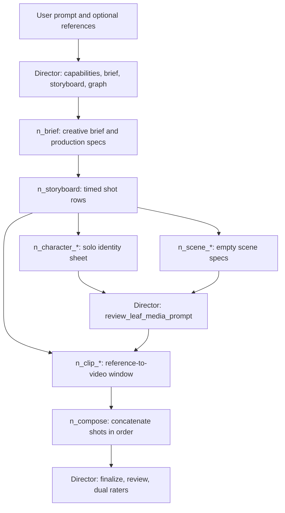

# Designer pipeline, from prompt to composed film

One director (`orchestration.Director`) plans the film and gates every media prompt. Leaf nodes do the model calls. The scheduler is `GraphExecutor` in `executor.py`.

## Graph

Same-setting shots do not wait on each other. Each shot waits on the storyboard, the characters who are on screen, and the scene for that setting.

## Step by step

1. **User enters a prompt** in the designer, with optional reference images, and chooses cost or quality.
2. **Bootstrap.** `designer_adapter` asks the director to author the brief and storyboard, then `build_smart_video_graph` lays down nodes and edges. Saved graphs that still say `clip` or `n_clip_*` are read as shots.
3. **Brief node** writes the markdown brief and production specs. Its only hard downstream node is the storyboard.
4. **Storyboard node** writes one row per shot: timeline, camera, action, speech, who is on screen, and the setting.
5. **Character nodes** each generate one solo sheet. They need the storyboard. They output an image only to shots that list that character on screen.
6. **Scene nodes** each generate one empty setting. They need the storyboard. They output an image to shots with the same setting id.
7. **Director leaf gate** rewrites the prompt for that character, scene, or shot so costume, scene specs, and speech stay consistent with the storyboard row.
8. **Shot nodes** send the on-screen solos plus the scene image to the video model and return one video file per row.
9. **Compose** waits until every shot file is usable, joins them in storyboard order, and writes the final video.
10. **Director ratings** score the run and store feedback. The finished file is not regenerated unless the user runs again.

## Where the code lives

| Stage | Code |
|-------|------|
| Director | `orchestration.py` class `Director` |
| Graph build | `smart_graph.py` |
| Schedule | `executor.py` `GraphExecutor` |
| Brief and storyboard | `handlers/text_nodes.py` |
| Character and scene | `handlers/image_nodes.py` |
| Shot | `handlers/clip.py` |
| Compose | `handlers/compose.py` |
| Prompt and consistency helpers | `pipeline/` |

Node pages: [BRIEF](./BRIEF.md) · [STORYBOARD](./STORYBOARD.md) · [CHARACTER](./CHARACTER.md) · [SCENE](./SCENE.md) · [CLIP](./CLIP.md) · [COMPOSE](./COMPOSE.md) · [DIRECTOR](./DIRECTOR.md)
